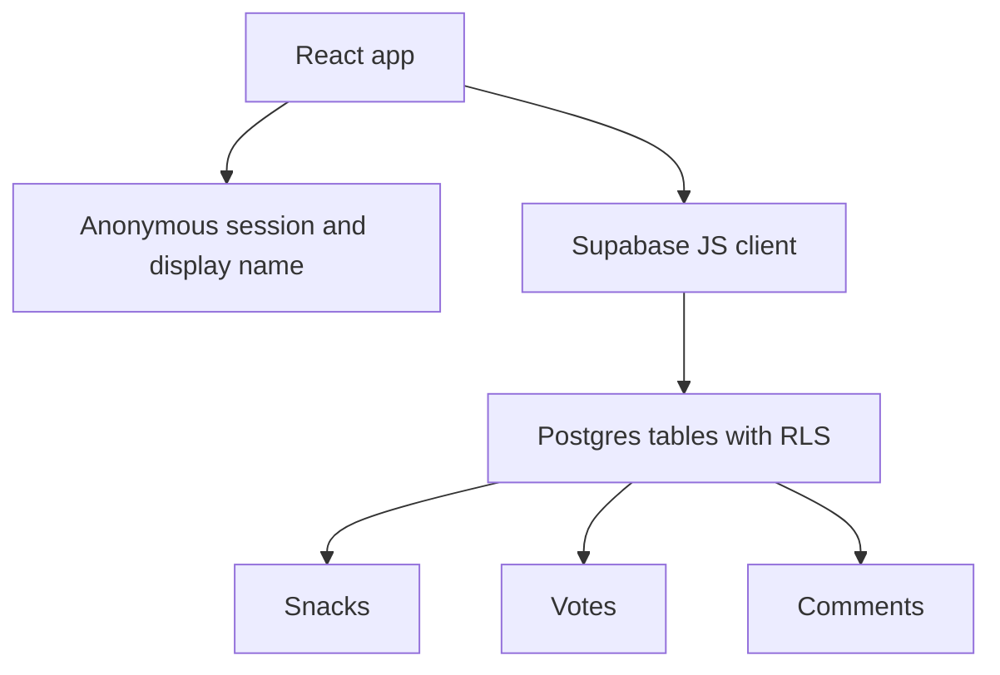

# Snack Squad - Plan

## Goal Capsule

- **Objective:** Build a lightweight remote-team snack board where people can suggest snacks, vote, comment, and keep the snack conversation visible outside Slack threads.
- **Product authority:** The v1 product is a culture app, not a purchasing, inventory, or procurement tool.
- **Execution profile:** Small greenfield web app with Supabase Postgres as shared persistence, anonymous Supabase sessions for ownership, and typed display names for v1.
- **Stop conditions:** Stop and ask before adding Slack integration, email/password login, magic-link login, Storage, Realtime, product lookup APIs, or procurement workflows.
- **Tail ownership:** Implementation owns the first working app, Supabase schema, local verification, and setup notes needed to run it.

---

## Product Contract

### Summary

Snack Squad will centralize the remote team's snack chatter into a shared board for suggestions, votes, and comments.
The first version should make the wishlist loop feel worth opening; pick-of-the-day, brackets, personal logs, and badges are follow-on layers around that core loop.

### Problem Frame

Snack discussion already exists in Slack channels and meeting agendas as a lightweight culture ritual.
The current shape is scattered: ideas, opinions, and running jokes live wherever the conversation happened.
The product should preserve that casual energy while giving the team one shared place to see what snacks people are excited about.

### Key Decisions

- **Use Supabase Postgres as the v1 backend.** The app is likely to transition to Supabase soon, so starting there avoids a short-lived Google Sheet migration.
- **Start with anonymous sessions and typed display names instead of real accounts.** Friction matters more than user-facing login for a trusted office-culture toy, but Supabase still needs a trustworthy session id for ownership policies.
- **Keep Slack identity as a later upgrade path.** Slack fits the remote-team context, but OAuth setup should wait until usage proves the app is worth integrating.
- **Use light snack normalization only.** The app should trim and compare names enough to nudge against duplicates, but it should not require a standardized product catalog.
- **Make cleanup author-owned in v1.** The team needs light edit/delete affordances for clutter, not approval queues or heavy moderation.

### Actors

- A1. **Team member:** Suggests snacks, votes, comments, and browses what the team likes.
- A2. **Future Slack user:** Uses Slack-linked identity if the app earns that integration later.

### Requirements

**Core wishlist loop**

- R1. Team members can submit a snack with a name, optional category or note, and optional image URL.
- R2. Team members can browse submitted snacks in a shared view that makes popular and recent snacks easy to scan.
- R3. Team members can vote on submitted snacks.
- R4. Team members can comment on submitted snacks.
- R5. The app should make the suggest, vote, and comment loop useful before contests, badges, or personal logs are added.

**Identity and cleanup**

- R6. V1 can identify people by a typed display name.
- R7. Users can edit or delete their own submissions and comments in a lightweight trust-based way.
- R8. V1 cleanup is limited to author-owned edits, deletes, and duplicate nudges.

**Snack quality and duplicates**

- R9. Snack names should be lightly normalized for duplicate detection, including trim and case-insensitive matching.
- R10. When a submitted snack looks similar to an existing snack, the app should nudge the user toward the existing entry instead of silently creating clutter.
- R11. Product images and metadata are optional in v1 and can be entered manually.

**Future fun layers**

- R12. Pick-of-the-day can be added after the wishlist loop works.
- R13. Weekly bracket contests can be added after the wishlist loop works.
- R14. Personal snack rating logs can be added after the wishlist loop works.
- R15. Badges and snack superlatives can be added after the app has enough activity to make them meaningful.

### Key Flows

- F1. **Submit a snack**
  - **Trigger:** A team member wants to suggest a snack.
  - **Actors:** A1
  - **Steps:** The team member enters a snack name, sees any likely duplicate nudge, adds optional details, and submits.
  - **Outcome:** The snack appears on the shared board or the team member joins an existing snack conversation.
  - **Covered by:** R1, R9, R10, R11

- F2. **React to a snack**
  - **Trigger:** A team member opens the board to see what people are discussing.
  - **Actors:** A1
  - **Steps:** The team member scans snacks, votes on one or more, and comments where they have an opinion.
  - **Outcome:** The shared board reflects the team's current snack preferences.
  - **Covered by:** R2, R3, R4, R5

- F3. **Clean up clutter**
  - **Trigger:** A duplicate, typo, or low-quality entry makes the board harder to scan.
  - **Actors:** A1
  - **Steps:** The author edits or deletes their own item, or a duplicate nudge redirects a new submission to an existing snack.
  - **Outcome:** The board stays readable without adding formal moderation.
  - **Covered by:** R7, R8, R10

### Acceptance Examples

- AE1. **Covers R9, R10.** Given "Doritos" already exists, when a team member submits " doritos ", then the app shows the existing snack as a likely match before creating another entry.
- AE2. **Covers R6, R7.** Given a team member submits a snack in the same anonymous session, when they return in that session, then they can perform lightweight edits or deletion for that item.
- AE3. **Covers R5, R12, R13, R14, R15.** Given the core board has little activity, when planning future layers, then pick-of-the-day, brackets, logs, and badges remain deferred until the wishlist loop is useful.

### Success Criteria

- Team members can use the app as the central place for snack suggestions instead of losing the thread in Slack.
- The v1 experience feels low-friction enough for a remote team to open casually.
- The first backend can support the later move to Slack identity without rethinking the product model.

### Scope Boundaries

#### Deferred for later

- Slack sign-in or Slack app integration.
- Email/password, magic-link, or social login.
- Pick-of-the-day.
- Weekly bracket contests.
- Personal snack rating logs.
- Badges and snack superlatives.
- External snack or product metadata lookup.
- Supabase Storage for uploaded snack images.
- Supabase Realtime subscriptions.
- Snack-owner or admin cleanup tools.

#### Outside this product's identity

- Purchasing workflows.
- Stocking or inventory management.
- Admin buying recommendations.
- Strict snack catalog enforcement.
- Approval queues before snacks or comments appear.

---

## Planning Contract

### Key Technical Decisions

- **KTD1. Use Vite, React, TypeScript, and Supabase JS for the greenfield app.** The repo has no existing app, and this stack gives the shortest conventional path to a browser UI with typed Supabase calls.
- **KTD2. Model v1 identity as anonymous Supabase auth plus a typed display name.** Anonymous sessions keep the UI login-free while giving RLS a real `auth.uid()` owner for edits, deletes, votes, and comments.
- **KTD3. Keep writes client-side through the Supabase client with RLS.** The MVP does not need an API server if table policies use session ownership and public read access only where intended.
- **KTD4. Store image URLs as text.** Uploaded images and Storage policies are deferred because optional external image URLs satisfy v1.
- **KTD5. Keep duplicate detection in app code plus a normalized database field.** A normalized snack name catches exact duplicates cheaply; fuzzy duplicate nudges can stay in client code until usage proves deeper matching matters.

### High-Level Technical Design

The browser app owns the v1 interaction loop and talks directly to Supabase with a publishable key.
Supabase stores snacks, votes, and comments with row-level policies that allow public reading and session-owned writes.
Anonymous auth is not user-facing account management; it is the minimal identity boundary needed for sane RLS.

### Proposed Data Shape

- **profiles:** auth user id, display name, timestamps.
- **snacks:** name, normalized name, optional category, note, image URL, creator auth user id, display name snapshot, timestamps, archived flag.
- **votes:** snack reference, auth user id, vote value, timestamps, unique snack/user pair.
- **comments:** snack reference, auth user id, display name snapshot, body, timestamps, deleted flag.

Planning should prefer ordinary tables and policies over functions, triggers, or Edge Functions unless implementation discovers a concrete need.

### Assumptions

- The user can create a free Supabase project before implementation starts.
- The app can accept anonymous sessions in v1 because they are invisible to users and avoid fake browser-token security.
- The app can expose read access to snack-board data because the intended audience is a private team link, not sensitive records.

### Risks & Dependencies

- **RLS can be too loose.** Keep policies minimal, use `auth.uid()` for ownership, and never expose service-role keys in the browser.
- **Anonymous sessions are device-scoped.** A user's ownership may not follow them across browsers until Slack or real account login is added.
- **Supabase free tier availability is external.** If the free project falls through, either pause implementation or swap back to the Google Sheet plan before coding.
- **Greenfield setup can sprawl.** Do not add routing, UI libraries, backend functions, storage, or realtime until the core board needs them.

### Sources / Research

- `docs/plans/2026-07-08-001-feat-snack-squad-plan.md` Product Contract.
- Supabase skill guidance: use RLS for exposed schemas and never expose service-role keys in public clients.

---

## Implementation Units

### U1. App Scaffold And Anonymous Profile

- **Goal:** Create the smallest runnable web app shell with anonymous Supabase session identity and typed display names.
- **Requirements:** R2, R5, R6
- **Files:** `package.json`, `package-lock.json`, `index.html`, `src/main.tsx`, `src/App.tsx`, `src/styles.css`, `src/supabaseClient.ts`, `src/profile.ts`, `src/profile.test.ts`
- **Approach:** Scaffold a Vite React TypeScript app, add Supabase JS, initialize an anonymous session, and store only the editable display name locally.
- **Test Scenarios:**
  - A new browser profile gets an anonymous Supabase session after first initialization.
  - Updating the display name preserves the same anonymous session.
  - Blank display names are rejected or normalized to a usable fallback.
- **Verification:** Run the unit test for the profile helper and start the dev server.
- **Dependencies:** None.

### U2. Supabase Schema And Client Boundary

- **Goal:** Add Supabase project configuration, schema migration, and a narrow data access module.
- **Requirements:** R1, R2, R3, R4, R6, R7, R8, R9, R10, R11
- **Files:** `supabase/migrations/001_initial_snack_squad.sql`, `.env.example`, `src/snackStore.ts`, `src/snackStore.test.ts`
- **Approach:** Define the tables for profiles, snacks, votes, and comments; enable RLS; use `auth.uid()` ownership policies; expose only the operations needed by the board through `snackStore`.
- **Test Scenarios:**
  - The store normalizes snack names before sending create requests.
  - The store surfaces likely exact duplicates before creating a snack.
  - Vote writes are idempotent for one anonymous user and one snack.
  - Comment writes require a non-empty body.
- **Verification:** Run the store unit tests with mocked Supabase calls; apply the migration to a local or hosted Supabase project before browser smoke testing.
- **Dependencies:** U1.

### U3. Snack Board Interactions

- **Goal:** Implement the visible suggest, vote, comment, and cleanup loop.
- **Requirements:** R1, R2, R3, R4, R5, R7, R8, R9, R10, R11
- **Files:** `src/App.tsx`, `src/styles.css`, `src/snackStore.ts`
- **Approach:** Build one screen with a submit form, snack list, vote controls, comment panel, duplicate nudge, and trust-based edit/delete controls for matching profile-owned items.
- **Test Scenarios:**
  - Submitting a unique snack adds it to the shared board.
  - Submitting a duplicate shows the existing snack nudge.
  - Voting changes the snack's visible score without adding duplicate votes.
  - Adding a comment shows it under the snack.
  - Owned snacks and comments expose edit/delete controls while other items do not.
- **Verification:** Run unit tests and manually smoke the flow against Supabase from a browser.
- **Dependencies:** U1, U2.

### U4. Setup Notes And MVP Guardrails

- **Goal:** Document the local setup, Supabase setup, and intentional v1 exclusions.
- **Requirements:** R5, R12, R13, R14, R15
- **Files:** `README.md`, `.env.example`
- **Approach:** Add concise setup steps for installing dependencies, configuring Supabase URL/key values, applying the migration, running tests, and starting the dev server.
- **Test Scenarios:**
  - A reader can identify which Supabase values belong in local env.
  - The README names the deferred features so implementation does not accidentally include them.
  - The verification commands match the package scripts.
- **Verification:** Follow the README commands once after implementation.
- **Dependencies:** U1, U2, U3.

---

## Verification Contract

| Gate | Command | Applies To | Done Signal |
|---|---|---|---|
| Typecheck | `npm run typecheck` | U1, U2, U3 | TypeScript passes without errors. |
| Unit tests | `npm test` | U1, U2, U3 | Profile and store tests pass. |
| Build | `npm run build` | U1, U3, U4 | Production build completes. |
| Supabase migration | `supabase db push` or hosted SQL editor equivalent | U2 | Tables and RLS policies exist in the target project. |
| Browser smoke | `npm run dev` | U3, U4 | Submit, duplicate nudge, vote, comment, and owned cleanup work against Supabase. |

---

## Definition of Done

- The plan's Product Contract remains unchanged except for confirmed scope corrections.
- Each implementation unit's verification passes.
- The app can run locally from README instructions.
- Supabase service-role or secret keys are not present in client code or committed env files.
- V1 ships without Slack integration, user-facing account login, Storage uploads, Realtime, product lookup APIs, brackets, badges, or personal snack logs.
- Dead-end scaffold code and unused generated assets are removed before completion.
