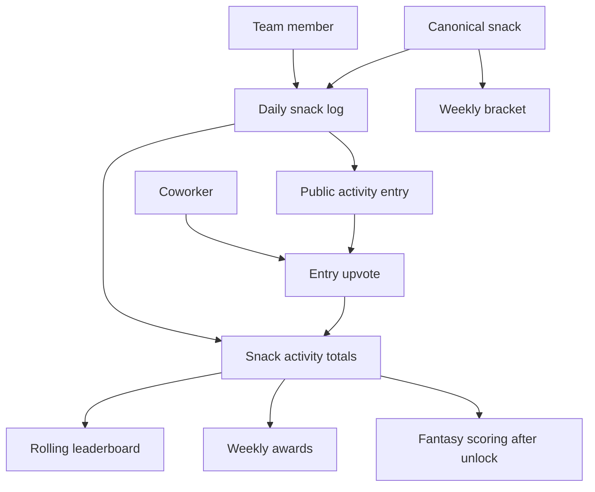
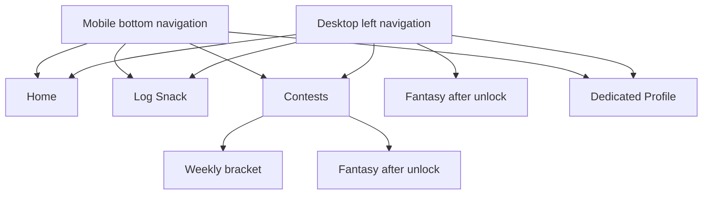
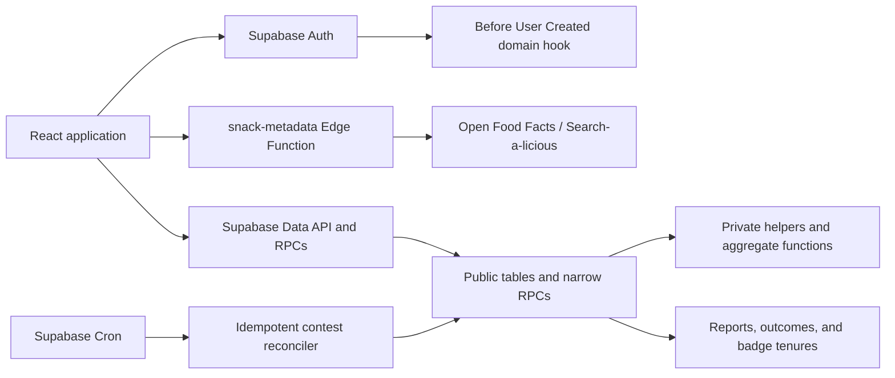
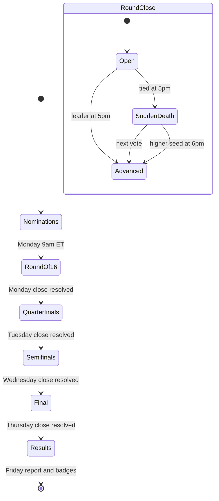

# Snack Squad Product Overhaul - Plan

## Goal Capsule

- **Objective:** Turn Snack Squad into a private company snack logger and social competition where daily activity feeds shared rankings, profiles, brackets, badges, and later fantasy leagues.
- **Product authority:** Snack Squad is a lightweight culture game, not a calorie tracker, nutrition authority, purchasing tool, or inventory system.
- **Launch audience:** Soft-launch to a 50-60 person Carnegie Higher Ed team, with roughly 30 expected initial participants.
- **Open blockers:** None.

---

## Product Contract

The confirmed Product Contract is preserved: R1-R63, A1-A5, F1-F6, and AE1-AE13 remain the implementation authority.

### Summary

Snack Squad will be rebuilt backend-first around canonical snacks, private daily logs, a limited shared board feed, and database-enforced competition rules.
The launch-ready product includes profiles, weekly brackets, badges, and Friday reports; fantasy is built last and remains unavailable until the pilot meets its activity targets.
The existing Vite, React, TypeScript, Supabase, and Open Food Facts boundary remain, while the legacy anonymous identity model, store shape, and interface are replaced.

### Problem Frame

The current product collects snack suggestions, votes, comments, ratings, and isolated contest features, but it does not establish a repeatable daily action.
Its globally unique snack records also make a snack and a person's interaction with that snack the same thing.

The overhaul needs a durable core loop: a person records today's snack, coworkers react to that event, and the resulting activity changes shared standings and earned recognition.
Competition should reward participation without turning the product into nutrition tracking or requiring constant administration.

### Key Decisions

- **A snack and a log are separate concepts.** One canonical snack can have many user-owned daily logs, allowing individual board entries and unified rankings at the same time.
- **One daily check-in is the scoring unit.** A user may create one scoring log for a given snack per Eastern Time calendar day.
- **Ownership is context-specific.** General awards credit qualifying loggers, bracket awards credit nominators, and fantasy results credit the current league roster manager.
- **Competition uses a rolling activity window.** The home leaderboard and weekly badge evaluation use the previous 30 days while all-time totals remain available as historical context.
- **The product remains social rather than nutritional.** Logs do not collect servings, calories, quantities, personal ratings, or comments.
- **The launch includes brackets and badges.** Fantasy rules are specified now but the feature remains unavailable until the four-week pilot meets its success criteria.
- **The interface is desktop-first and responsive.** Desktop uses a persistent left navigation and dedicated pages; mobile uses a compact bottom navigation.
- **The pilot starts clean.** No current data exists to migrate or back up, so the overhaul begins with an empty catalog and activity history.
- **Canonical metadata is moderated.** Members may suggest fixes, but designated moderators own authoritative edits, category overrides, nutrition verification, and duplicate merges.

The canonical snack model is the shared authority for every derived surface:

### Actors

- A1. **Team member:** Signs in, logs snacks, upvotes board entries, manages a profile, and participates in weekly contests.
- A2. **Bracket participant:** Nominates one snack for the week, votes in each round, and shares ownership when coworkers nominate the same snack.
- A3. **Fantasy manager:** Joins a private league, drafts a five-snack roster, manages weekly waivers, and earns points from other users' activity.
- A4. **Contest automation:** Closes scoring windows, advances brackets, assigns award periods, executes fantasy auto-picks, and publishes Friday results.
- A5. **Metadata moderator:** Reviews suggested corrections and maintains trustworthy canonical snack records.

### Requirements

**Access and identity**

- R1. Users must authenticate through an emailed magic link before viewing or using Snack Squad.
- R2. New accounts must be rejected unless the normalized email address ends in `@carnegiehighered.com`.
- R3. The pilot will rely on link distribution rather than an email allowlist, so any eligible company employee who discovers the link may enter.
- R4. A new profile must receive a readable display name derived from the email address and allow the user to edit it.
- R5. A user must be able to select and change one favorite snack.
- R6. Authenticated coworkers may view another user's favorite snack, aggregate stats, and badges.
- R7. A user's detailed daily log history must remain visible only to that user.

**Snack catalog and logging**

- R8. Searching to log a snack must return live product suggestions through the existing metadata boundary without making one remote search request per keystroke.
- R9. Selecting a search suggestion must create a one-tap log containing the canonical snack, user, and timestamp.
- R10. One user may create at most one scoring log for the same canonical snack per Eastern Time calendar day.
- R11. Different users' logs of the same canonical snack must remain separate activity entries.
- R12. A user may edit, replace, or delete an owned log until its Eastern Time calendar day closes.
- R13. Editing or deleting an open log must remove its board entry, upvotes, and derived points from unsettled totals.
- R14. A product missing from Open Food Facts may be entered manually with a name and one Snack Squad category.
- R15. A manually entered product participates in logs, rankings, brackets, and fantasy but cannot receive the nutrition award until verified nutrition data exists.
- R16. Open Food Facts categories must map into Grains/Bakery, Protein, Dairy, Fruit, Vegetables, Candy/Sweets, Chips/Savory Snacks, Beverages, or Other.
- R17. Logs must not request servings, quantities, calories, personal ratings, or comments.

**Board, rankings, and profiles**

- R18. Each settled or open daily log must appear as its own entry on the authenticated group board.
- R19. A user may upvote each board entry once but may not upvote their own entry.
- R20. Every valid entry upvote must contribute to the canonical snack's aggregate upvote total.
- R21. The home screen must show the ten snacks with the most valid upvotes in the rolling 30-day window.
- R22. Snack detail or historical surfaces must retain all-time log and upvote totals separately from the rolling leaderboard.
- R23. A profile summary must show the selected favorite, aggregate log activity, category mix, and earned badge history without exposing individual private logs.

**Weekly bracket**

- R24. Each user may nominate one canonical snack for the next weekly bracket.
- R25. Duplicate nominations must create one bracket entry and make every nominator a co-owner of that entry.
- R26. The sixteen unique snacks with the most nominators must qualify, with earlier nomination breaking equal nomination counts.
- R27. Open bracket slots must be filled from the rolling leaderboard when voting begins.
- R28. A leaderboard-filled snack with no nomination may win the bracket but grants no participant badge because it has no bracket owner.
- R29. The bracket must run a Round of 16 on Monday, quarterfinals Tuesday, semifinals Wednesday, and the final Thursday.
- R30. Each round must close at 5:00 PM Eastern.
- R31. An authenticated user may cast one vote in each active matchup.
- R32. A tied matchup must remain open for one hour of sudden death, with the next valid vote deciding the winner.
- R33. If a matchup remains tied at 6:00 PM Eastern, the higher seed must advance.
- R34. Friday results must award the bracket champion badge to every nominator who co-owned the winning entry.

**Badges and weekly report**

- R35. Friday award evaluation must use the rolling 30-day activity window.
- R36. The weekly awards must include Top Snack, Nutrition Standout, and the top-upvoted snack in each of the nine Snack Squad categories.
- R37. Nutrition Standout must use the best available Nutri-Score among eligible products logged during the award window.
- R38. Top Snack and category awards must credit every user who logged the winning snack during the evaluated window.
- R39. A badge definition must be unique while each holder's tenure records a start date and an optional end date.
- R40. Consecutive wins must extend the active tenure instead of creating duplicate awards.
- R41. When a holder is dethroned, the active tenure must close, and a later reclaimed award must create a new tenure.
- R42. The in-app Friday report must show leaderboard changes, category winners, the bracket champion, and newly started or ended badge tenures.

**Fantasy leagues after unlock**

- R43. Fantasy must remain unavailable until the four-week pilot meets all stated success criteria.
- R44. Users must be able to create or join private fantasy leagues containing four to eight managers.
- R45. Each monthly roster must contain five snacks from five distinct Snack Squad categories.
- R46. A snack may belong to only one manager within a league for that month but may be drafted in other leagues.
- R47. Each league's monthly draft order must be randomized and follow a snake pattern across five rounds.
- R48. Draft picks may be submitted at any time while the draft is active.
- R49. A manager's three-business-hour pick clock must advance only from 9:00 AM to 5:00 PM Eastern on weekdays.
- R50. When the clock expires, the system must select the manager's highest-ranked available snack that fits an open roster category.
- R51. If the manager has no eligible ranked choice, the system must select the highest rolling-leaderboard snack that fits an open category.
- R52. Every qualifying log or upvote by any Snack Squad user must earn one fantasy point for the manager rostering that snack.
- R53. A manager's own logs and upvotes must not score points for that manager's roster.
- R54. Each manager may replace one rostered snack through Friday waivers, and the replacement must preserve distinct categories and league exclusivity.
- R55. Monthly league winners must receive a fantasy champion badge in their profile history.

**Navigation and responsive behavior**

- R56. Desktop must use a persistent left navigation for Home, Log Snack, Contests, Fantasy when unlocked, and Profile.
- R57. Profile must be a dedicated page rather than a temporary drawer.
- R58. Home must prioritize quick snack search, the activity board, and the rolling Top 10.
- R59. Mobile must use bottom navigation for Home, Log, Contests, and Profile.
- R60. Fantasy must remain inside the mobile Contests area when unlocked rather than adding a fifth bottom-navigation item.

**Pilot data**

- R61. The overhauled pilot must start with an empty snack catalog and activity history without migrating or backing up the current empty dataset.

**Metadata moderation**

- R62. Any authenticated member may suggest a correction to a canonical snack without directly changing the shared record.
- R63. Only designated moderators may edit canonical metadata, override categories, verify nutrition eligibility, or merge duplicate snacks.

The navigation adapts by device without changing the product hierarchy:

### Key Flows

- F1. **Magic-link entry**
  - **Trigger:** A team member opens Snack Squad without an active session.
  - **Actors:** A1
  - **Steps:** The member enters a company email, receives a magic link, follows it, and confirms or edits the prefilled display name.
  - **Outcome:** An eligible employee reaches the authenticated Home screen with a durable profile.
  - **Covered by:** R1-R7

- F2. **Log today's snack**
  - **Trigger:** A member wants to record a snack.
  - **Actors:** A1
  - **Steps:** The member searches, chooses an API suggestion or enters a manual snack, and confirms the one-tap check-in.
  - **Outcome:** The private history and public board gain a daily log tied to one canonical snack.
  - **Covered by:** R8-R17

- F3. **React and rank**
  - **Trigger:** A member browses recent team activity.
  - **Actors:** A1
  - **Steps:** The member views separate daily entries and upvotes entries created by coworkers.
  - **Outcome:** Entry reactions roll into canonical snack totals and the rolling leaderboard.
  - **Covered by:** R18-R23

- F4. **Run the weekly bracket**
  - **Trigger:** A new contest week begins.
  - **Actors:** A2, A4
  - **Steps:** Nominations merge by canonical snack, empty slots fill from the leaderboard, one round closes each workday, and ties enter bounded sudden death.
  - **Outcome:** Thursday produces a champion and Friday awards every qualifying co-owner.
  - **Covered by:** R24-R34

- F5. **Publish weekly recognition**
  - **Trigger:** Friday award evaluation runs.
  - **Actors:** A1, A4
  - **Steps:** Rolling activity determines general and category leaders, eligible nutrition data determines Nutrition Standout, and badge tenures open, continue, or close.
  - **Outcome:** Members can view the week's results and updated profile badges.
  - **Covered by:** R35-R42

- F6. **Draft and score a fantasy month**
  - **Trigger:** Fantasy is unlocked and a private league begins a new month.
  - **Actors:** A3, A4
  - **Steps:** Managers complete an asynchronous snake draft, missed turns auto-pick, outside-user activity scores rosters, and Friday waivers allow one category-preserving replacement.
  - **Outcome:** The month ends with standings and a fantasy champion badge.
  - **Covered by:** R43-R55

### Acceptance Examples

- AE1. **Covers R2.** Given an unauthenticated visitor enters a non-company email, when account creation is attempted, then access is rejected before a user account is created.
- AE2. **Covers R10, R11.** Given Alex has logged Doritos today, when Alex tries again, then no second scoring log is created; when Jordan logs Doritos, Jordan receives a separate board entry tied to the same canonical snack.
- AE3. **Covers R12, R13.** Given a same-day log has two upvotes, when its owner deletes it before midnight Eastern, then the entry, upvotes, and unsettled derived points are removed.
- AE4. **Covers R14-R16.** Given search returns no product, when a user manually adds a snack in Candy/Sweets, then it can rank and enter contests but cannot win Nutrition Standout.
- AE5. **Covers R19, R20.** Given two coworkers logged the same snack, when a third coworker upvotes both entries, then two upvotes are added to the canonical snack total.
- AE6. **Covers R25-R28.** Given three users nominate the same snack, when the bracket is seeded, then it occupies one slot with three co-owners; an auto-filled snack has no bracket owner.
- AE7. **Covers R32, R33.** Given a matchup is tied at 5:00 PM Eastern, when a new valid vote arrives before 6:00 PM, then that vote decides the matchup; otherwise the higher seed advances at 6:00 PM.
- AE8. **Covers R39-R41.** Given a user retains Top Snack ownership for three consecutive reports, then one open tenure spans all three; when dethroned and later restored, a new tenure begins.
- AE9. **Covers R43.** Given the pilot has not completed four weeks or misses any success target, when a user opens Contests, then fantasy remains unavailable.
- AE10. **Covers R48-R51.** Given a manager goes on the clock at 4:00 PM Eastern, then one hour elapses by 5:00 PM and the remaining two hours resume at 9:00 AM; an overnight manual pick remains valid.
- AE11. **Covers R52, R53.** Given a manager rosters Doritos, when another user logs or upvotes Doritos, then the roster earns one point; the manager's own equivalent activity earns none.
- AE12. **Covers R54.** Given a manager replaces a Dairy snack on Friday, then the replacement must be an undrafted Dairy snack and no second waiver is allowed that week.
- AE13. **Covers R62, R63.** Given a member suggests that a manual snack duplicates an API product, when a moderator accepts the correction, then the canonical records merge without granting the member direct edit authority.

### Success Criteria

- More than 5 daily active users during the four-week pilot.
- At least one weekly bracket receives a vote in every matchup through the final.
- The active user base grows across the pilot rather than declining or remaining flat.
- Users average at least 3 snack logs per week.
- Fantasy remains gated until all four signals are met after the pilot period.

### Scope Boundaries

#### Deferred for later

- Fantasy activation after the four-week pilot meets its success criteria.
- Expansion from the pilot team to the full company.
- Email delivery of the Friday report.
- A stricter email allowlist or invitation system if soft-launch distribution proves insufficient.

#### Outside this product's identity

- Calorie, serving, macro, or dietary-goal tracking.
- Purchasing, stocking, inventory, procurement, or approval workflows.
- Public or non-company access.
- Comments or discussion threads on logs or snacks.
- Requiring every snack to exist in an external catalog.
- Medical or universal claims that one product is objectively the healthiest.

### Dependencies and Assumptions

- Supabase magic-link authentication and a server-side Before User Created hook can enforce the company email domain.
- Production magic-link delivery will require a dependable email provider and correct redirect configuration.
- Open Food Facts coverage is incomplete, so manual products and an unverified nutrition state are required.
- The product search experience must respect Open Food Facts search-rate constraints through delayed requests and reuse of known products.
- Eastern Time is the shared authority for daily, weekly, and monthly boundaries.
- The expected pilot scale is roughly 30 active users from a 50-60 person team.
- The current app uses anonymous sessions and globally unique snack records, so the overhaul must change those behaviors rather than layer daily logging onto them unchanged.
- At least one moderator identity will be designated before the pilot opens.

### Planning Resolutions

- Bracket nominations open after Friday results publish and close Monday at 9:00 AM Eastern, when Round of 16 voting begins.
- Equal activity results resolve by upvotes, then logs, then normalized canonical snack name; Nutrition Standout first compares Nutri-Score and then applies the same activity ordering.
- Fantasy pick clocks pause outside weekday 9:00 AM-5:00 PM Eastern hours but do not pause for company holidays in the first version.

### Sources / Research

- `docs/plans/2026-07-08-001-feat-snack-squad-plan.md` documents the current suggestion-board product and original guardrails.
- `src/profile.ts` shows the current anonymous-session identity behavior.
- `supabase/migrations/001_initial_snack_squad.sql` shows the current globally unique snack model and snack-level voting.
- `supabase/functions/snack-metadata/` contains the existing Open Food Facts lookup boundary that can be extended during planning.
- [Supabase Before User Created Hook](https://supabase.com/docs/guides/auth/auth-hooks/before-user-created-hook) documents server-side email-domain restrictions.
- [Supabase Passwordless Email Login](https://supabase.com/docs/guides/auth/auth-email-passwordless) documents magic-link behavior.
- [Open Food Facts API documentation](https://openfoodfacts.github.io/documentation/docs/Product-Opener/api/) documents product fields, computed nutrition values, and search-rate constraints.
- [Supabase Auth Hooks](https://supabase.com/docs/guides/auth/auth-hooks) documents hook grants, time limits, and migration-based configuration.
- [Supabase Redirect URLs](https://supabase.com/docs/guides/auth/redirect-urls) documents exact production redirect allowlisting for passwordless flows.
- [Supabase custom SMTP](https://supabase.com/docs/guides/auth/auth-smtp) documents the default provider's production restrictions and custom-provider requirement.
- [Supabase Cron](https://supabase.com/docs/guides/cron) documents direct scheduling of database functions and job-run history.
- [Supabase Database Functions](https://supabase.com/docs/guides/database/functions) documents invoker-first functions, restricted execution grants, and safe `search_path` handling.
- [Supabase Data API grant change](https://supabase.com/changelog/45329-breaking-change-tables-not-exposed-to-data-and-graphql-api-automatically) requires explicit grants for new public tables.
- `PRODUCT.md` records the approved product personality, anti-references, and accessibility posture.
- `DESIGN.md` and `docs/design/collectible-culture-direction.png` record the approved Collectible Culture Board direction and its non-literal mock constraints.

---

## Planning Contract

### Key Technical Decisions

#### Backend and security

- KTD1. **Replace the empty legacy model through forward migrations.** Create migrations with `npm.cmd exec -- supabase migration new <name>`; do not edit migrations `001`-`006`. The first overhaul migration drops the legacy snack, vote, comment, rating, bracket-vote, and anonymous-profile structures in dependency order, then creates the new foundation. This keeps local resets and already-linked projects on the same history while honoring R61.
- KTD2. **Keep private data private at the database boundary.** Revoke `anon` access from application tables, grant only required operations to `authenticated`, enable RLS everywhere, and index every foreign key and RLS predicate. Never expose a service-role or secret key to the browser. A user's full `snack_logs` rows remain self-readable; narrow authenticated RPCs return a paginated board projection, leaderboard, and public profile summaries without exposing unrestricted coworker log queries.
- KTD3. **Use constraints as the scoring authority.** Store `logged_on` as the Eastern calendar date assigned by the database and enforce `(user_id, snack_id, logged_on)` uniqueness. Enforce one upvote per `(log_id, user_id)`, bracket vote uniqueness per matchup, one nomination per user/week, category checks, roster exclusivity, and badge-tenure uniqueness in Postgres rather than client checks.
- KTD4. **Use a small private function layer for cross-row rules.** Default functions to security invoker. Use narrowly scoped security-definer functions only where RLS must safely expose cross-user aggregates or perform contest automation; each must validate the caller when user-invoked, set `search_path = ''`, fully qualify relations, and revoke execution from unneeded roles.
- KTD5. **Use a database moderator role, not editable user metadata.** `moderators` is keyed by `auth.users.id`. A private `is_moderator` helper backs metadata policies, while designation remains an explicit SQL/operational step rather than a new admin console.
- KTD6. **Treat rankings as queries and awards as history.** Rolling and all-time totals derive from indexed logs and upvotes through RPCs; do not maintain mutable counters. Persist bracket outcomes, weekly reports, and badge tenures because those are historical decisions that must not change when later activity changes.
- KTD7. **Centralize Eastern Time and idempotent automation in Postgres.** Private time helpers own day and business-hour calculations using `America/New_York`. One recurring Supabase Cron reconciler runs every five minutes, takes a transaction-scoped advisory lock, and advances only eligible states. Unique constraints and conditional updates make reruns safe.

#### Catalog and external data

- KTD8. **Search the local catalog first and throttle remote search.** The client queries known canonical snacks immediately, waits until at least three characters and 400 ms of inactivity before invoking the Edge Function, cancels stale responses, and reuses selected products in `snacks`. Barcode queries may execute immediately.
- KTD9. **Extend the existing Edge Function instead of adding another service.** Add brand, barcode, source taxonomy, image, Nutri-Score, and nutrition-completeness fields to the current Open Food Facts mapping. Keep the contact-bearing server request, request only required fields, preserve timeout/error handling, and allow manual catalog entries when results are missing. Treat upstream fields as untrusted: cap text lengths, allow only expected scalar/array shapes, accept only HTTPS source/image URLs, and render all returned copy as text.
- KTD10. **Make category and nutrition eligibility explicit.** Persist one of the nine Snack Squad categories, including `Other`, retain source categories for moderator review, and require both verified metadata and a valid Nutri-Score before Nutrition Standout eligibility. Category mapping is deterministic but moderator-overridable. A non-null barcode is unique; products without barcodes are not globally deduplicated by normalized name alone and instead use moderator merge review.
- KTD11. **Merge duplicates without rewriting history in the client.** A moderator-only database operation moves logs, contest ownership, roster references, and correction history to the survivor inside one transaction, handles uniqueness conflicts deterministically, and marks the duplicate as merged.

#### Contests, badges, and fantasy

- KTD12. **Model brackets as persisted state.** Weeks, entries, co-owners, matchups, and votes are rows with status and timestamps. Friday results publish at 9:00 AM Eastern and open nominations through Monday 9:00 AM. A voter may change a vote while a matchup is open, with the latest vote counting. The reconciler seeds sixteen entries, opens/closes rounds, enters sudden death, and applies the 6:00 PM higher-seed fallback; a valid sudden-death vote advances the winner atomically in the vote operation.
- KTD13. **Evaluate badges from stable weekly snapshots.** Friday automation stores winner facts and report deltas, extends consecutive tenures, closes dethroned tenures, and opens reclaimed tenures. Activity ties use upvotes, logs, then normalized name; Nutrition Standout first uses Nutri-Score.
- KTD14. **Build fantasy last behind an operational unlock.** The schema and product are implemented after brackets and badges. `fantasy_enabled` remains false until a moderator reviews the four-week metrics report and records the unlock; the UI and write RPCs both enforce the flag. Private leagues use an opaque shareable join code rather than email invitations, and joining closes when the monthly draft starts.
- KTD15. **Derive fantasy points from source activity.** All managers receive the same scoring start when the draft completes, and scoring ends with that calendar month. Standings join qualifying logs and upvotes to the roster's scoring interval and exclude actions by that roster's manager, avoiding both early-picker advantage and a second mutable points ledger. Managers tied for the highest final score share the monthly championship and badge.
- KTD16. **Keep the draft clock simple and auditable.** A monthly draft opens at 9:00 AM Eastern on the first calendar day; if that day is a weekend, manual picks are allowed while the business clock waits for Monday. Store pick deadlines and ranked preferences, compute elapsed business time only on weekdays from 9:00 AM-5:00 PM Eastern, and allow manual picks at any hour. Auto-pick uses the queue first, then rolling leaderboard order. Company holidays are not modeled in version one. A season cannot start until a preflight proves the available catalog can supply five distinct categories per manager while honoring in-league snack exclusivity.

#### Frontend and design

- KTD17. **Replace the interface after backend contracts are stable.** Keep Vite, React, TypeScript, and `@supabase/supabase-js`; remove the legacy anonymous-session UI and obsolete comments, ratings, archive, CSV, and suggestion-board behaviors. Use an internal view state and browser history only where needed; do not add a router solely for five authenticated views.
- KTD18. **Use a small feature-oriented frontend.** `App.tsx` owns session and top-level navigation. Separate auth, core snack/profile data, contests, and fantasy into focused modules; split screen components only where the current single-file pattern would become unreadable. Do not introduce a general state-management or design-system dependency.
- KTD19. **Make the redesign a gated Impeccable craft phase.** `PRODUCT.md` is the strategic authority, and the approved structural north star is the Collectible Culture Board captured in `DESIGN.md` and `docs/design/collectible-culture-direction.png`. Shape and direction selection are complete. After backend verification, produce and confirm the dedicated palette artifact, then generate one high-fidelity north-star screen against that palette and obtain approval before replacement frontend code. Never extract the obsolete current black/citrus UI as the target design system.
- KTD20. **Apply Emil's interaction standard without animation theater.** Motion communicates state or feedback, uses explicit properties and strong ease-out/ease-in-out curves, stays under 300 ms for routine UI, gives pressables a subtle active response, uses trigger-aware popover origins, gates hover to fine pointers, avoids keyboard-action animation, and provides reduced-motion behavior. Prefer CSS transitions or WAAPI; add no motion library unless an approved interaction cannot be built cleanly without it.
- KTD21. **Design desktop-first but verify structural mobile adaptation.** Desktop uses persistent left navigation and full pages. Mobile changes composition and uses bottom navigation; it does not merely shrink desktop. Loading, empty, error, success, disabled, overflow, long-text, keyboard, touch, and offline-like API failure states are part of each screen's acceptance bar.
- KTD22. **Coordinate the destructive cutover.** Develop and verify U1-U7 against local or non-production Supabase. Do not apply the overhaul migration to the shared pilot project while the legacy frontend is deployed. Release the migration, Auth/Cron configuration, Edge Function, and compatible frontend as one scheduled cutover after the empty-data check passes.

### High-Level Technical Design

The database owns identity-linked records, privacy, time boundaries, uniqueness, contest transitions, and scoring. The Edge Function owns external product lookup. The React app owns presentation, optimistic feedback only where safe, and navigation; it never decides authoritative scores or contest outcomes.

### Data Model

| Area | Tables | Notes |
| --- | --- | --- |
| Identity | `profiles`, `moderators`, `feature_flags` | Profiles reference `auth.users`; fantasy stays off until an audited unlock. |
| Catalog | `snacks`, `snack_corrections` | Canonical product, source metadata, category, verification, and merge state. |
| Activity | `snack_logs`, `log_upvotes` | Private owned history plus narrow board/aggregate RPCs. |
| Bracket | `bracket_weeks`, `bracket_entries`, `bracket_entry_owners`, `bracket_matchups`, `bracket_votes` | Persisted weekly state and co-ownership. |
| Recognition | `badge_definitions`, `badge_tenures`, `weekly_reports` | Stable history and Friday report payloads. |
| Fantasy | `fantasy_leagues`, `fantasy_league_members`, `fantasy_seasons`, `fantasy_draft_preferences`, `fantasy_draft_picks`, `fantasy_roster_slots`, `fantasy_waivers` | Private leagues, draft audit, effective rosters, and one weekly waiver. |

All timestamps use `timestamptz`. Human-facing day/week/month keys use typed `date` values derived in Eastern Time rather than free-form strings. Text state values use check constraints unless a stable Postgres enum materially improves the migration.

### State Transitions

### System-Wide Impact

- **Authentication:** Anonymous sessions are removed. The auth hook protects new account creation; pre-existing ineligible or anonymous Auth users must be removed before launch because the hook is not retroactive.
- **Privacy:** Coworkers receive board and profile-summary projections, never unrestricted access to another user's `snack_logs` table rows.
- **Deletion:** Same-day log deletion cascades unsettled upvotes. Persisted Friday reports and settled awards remain historical records and do not retroactively change.
- **Time:** Every cutoff is computed from `America/New_York`, including daylight-saving transitions. Browser locale is display-only.
- **External API:** Search remains usable when Open Food Facts is unavailable because local canonical products and manual entry remain available.
- **Performance:** Pilot queries use composite/partial indexes matching feed, rolling-window, ownership, contest-state, and RLS filters. No cache service or materialized counter is justified at the expected scale.

### Risks and Dependencies

- Custom SMTP, exact production redirect URLs, and the Auth hook must be configured before testing with coworkers. Supabase's default email provider is not a production delivery path. Configure pilot-appropriate Auth email rate limits and enforce a resend cooldown in the sign-in screen so launch traffic does not exhaust SMTP capacity.
- Open Food Facts search and nutrition coverage are incomplete and rate-limited. Remote lookup failures must not block manual logging.
- Supabase Cron runs in UTC while product cutoffs are Eastern; database functions, not cron expressions, decide whether a transition is due.
- A destructive schema replacement is safe only because the user confirmed the pilot dataset is empty. Before applying remotely, inspect row counts and stop if that assumption is false.
- Fantasy "growing user base" remains an operational judgment shown in the metrics report; fantasy does not auto-enable from an ambiguous growth formula.
- The Impeccable craft workflow requires user approvals between backend completion and frontend implementation. Those approvals are intentional execution gates, not planning gaps.

---

## Implementation Units

### U1. Replace legacy storage and establish authenticated identity

- **Goal:** Create the secure schema foundation for magic-link users, canonical snacks, private logs, board reactions, profiles, moderators, and feature gating.
- **Requirements:** R1-R7, R10-R23, R61-R63; AE1-AE5, AE13.
- **Dependencies:** None.
- **Files:** `supabase/config.toml`; `supabase/migrations/<CLI-generated>_snack_squad_overhaul.sql`; `supabase/tests/database/snack_squad_overhaul.test.sql`; `src/profile.ts`; `src/profile.test.ts`; `docs/auth-setup.md`.
- **Approach:** Initialize Supabase local configuration if absent. Create the migration through the CLI, drop legacy application tables after a defensive empty-data check, create the core tables/functions/indexes/grants/RLS, add the Before User Created hook, and create profiles from confirmed Auth users. Replace anonymous-profile helpers with session observation, magic-link request, sign-out, and email-derived display-name behavior.
- **Test scenarios:** Reject non-company user creation; allow case-insensitive company domains; prevent anonymous table access; restrict full logs to owners; expose only narrow cross-user feed/profile projections; reject duplicate daily logs, self-upvotes, and duplicate entry upvotes; allow same-day owner edit/delete and reject closed-day mutation; verify moderator-only writes.
- **Verification:** `npm.cmd exec -- supabase db reset`; `npm.cmd exec -- supabase test db`; `npm.cmd run typecheck`; `npm.cmd test`.

### U2. Complete catalog search, nutrition, and moderation

- **Goal:** Make logging work from local or remote search while keeping canonical metadata trustworthy and resilient to missing API data.
- **Requirements:** R8-R9, R14-R16, R62-R63; AE4, AE13.
- **Dependencies:** U1.
- **Files:** `src/snackMetadata.ts`; `src/snackMetadata.test.ts`; `supabase/functions/snack-metadata/index.ts`; `supabase/functions/snack-metadata/product.ts`; existing Edge Function tests; `supabase/migrations/<CLI-generated>_catalog_metadata.sql`.
- **Approach:** Expand requested/mapped Open Food Facts fields, add deterministic category mapping and nutrition eligibility, require an authenticated function invocation, and preserve manual fallback. Implement local-first result merging with a three-character minimum, 400 ms debounce, stale-request cancellation, and selected-product upsert. Add correction submission, moderator approval, and transactional duplicate merge operations.
- **Test scenarios:** Local results appear without a remote call; rapid typing produces one final lookup; barcode lookup remains immediate; stale responses do not replace newer results; incomplete products are unverified; mapped categories are stable; manual snacks remain usable; duplicate merges preserve logs and owners without violating unique constraints.
- **Verification:** `npm.cmd test`; `npm.cmd run typecheck`; deploy to a test project and confirm name, barcode, no-result, 429, timeout, and malformed-response paths.

### U3. Build bracket, badge, and Friday-report automation

- **Goal:** Implement persisted weekly competition and recognition with idempotent database transitions.
- **Requirements:** R24-R42; AE6-AE8.
- **Dependencies:** U1, U2.
- **Files:** `supabase/migrations/<CLI-generated>_weekly_competitions.sql`; `supabase/tests/database/weekly_competitions.test.sql`; `src/contestStore.ts`; `src/contestStore.test.ts`.
- **Approach:** Add bracket, badge, report tables and narrow RPCs. Implement Friday-to-Monday nomination, seeding, daily round close, sudden death, higher-seed fallback, award snapshotting, tenure changes, and one in-app Friday report. Schedule one five-minute reconciler with an advisory transaction lock and idempotent state predicates.
- **Test scenarios:** Merge duplicate nominations; seed by owners and time; fill from the rolling leaderboard; deny multiple matchup votes; resolve clear leaders, sudden-death votes, and 6:00 PM ties; badge all winning owners; extend, close, and reclaim badge tenures; rerun every transition without duplicate records.
- **Verification:** Reset and run database tests with fixed timestamps spanning Monday-Friday, month boundaries, and Eastern daylight-saving dates; run TypeScript tests for presentation mapping.

### U4. Replace the frontend data boundary before redesigning screens

- **Goal:** Wire all core and weekly-product behavior into small typed client modules without carrying forward obsolete UI assumptions.
- **Requirements:** R1-R42, R56-R63.
- **Dependencies:** U1-U3.
- **Files:** `src/supabaseClient.ts`; `src/profile.ts`; `src/snackStore.ts`; `src/contestStore.ts`; `src/snackMetadata.ts`; associated tests; `src/errors.ts`.
- **Approach:** Replace legacy table-wide reads and client-side score calculation with narrow RPC calls and typed mutation helpers. Centralize session loading and auth errors, keep authoritative validation in Postgres, and provide explicit loading/error results to the future screens. Delete comment, rating, archive, CSV, anonymous identity, and client-generated bracket code once no callers remain.
- **Test scenarios:** Map empty/loading/error/success responses; refresh after mutations; retain session through reload; show domain-hook and expired-link errors clearly; verify no client helper can fetch another user's private history; ensure all obsolete exports and callers are removed.
- **Verification:** `rg -n "signInAnonymously|SnackComment|snack_ratings|snack_comments|snacksToCsv|getWeeklyBracket" src`; `npm.cmd test`; `npm.cmd run typecheck`; `npm.cmd run build`.

### U5. Establish and approve the new visual system

- **Goal:** Produce a confirmed ground-up product direction before replacement UI code is written.
- **Requirements:** R56-R60 and all accessibility implications of R1-R63.
- **Dependencies:** U4.
- **Files:** `PRODUCT.md`; `DESIGN.md`; `docs/design/collectible-culture-direction.png`; `.impeccable/live/config.json` if live iteration is enabled; no production TSX/CSS files before the remaining approvals.
- **Approach:** Resume Impeccable craft from the approved Collectible Culture Board probe. Produce one palette artifact for the near-black, cobalt, acid-yellow, red, white, and gray system and obtain approval. Generate one high-fidelity desktop/mobile north-star screen against that palette and obtain approval or explicit delegation. Cover sign-in, Home, Log Snack, Contests, Profile, shared navigation, search dropdown, feed entry, leaderboard, loading, empty, error, and locked-fantasy states. Replace the seed placeholders in `DESIGN.md` with the approved tokens, typography, component vocabulary, responsive rules, imagery strategy, and motion posture before writing UI code.
- **Test scenarios:** Confirm the direction is playful, competitive, polished; avoids generic SaaS, childish candy-store, betting, and template-AI cues; meets contrast targets; uses familiar product affordances; structurally adapts desktop navigation to mobile bottom navigation; has no inaccessible color-only meaning.
- **Verification:** The direction-selection gate is recorded as complete; palette and high-fidelity north-star approvals remain required. Check the final visual inventory against `PRODUCT.md` and the non-literal constraints in `DESIGN.md`; no frontend implementation begins before those approvals.

### U6. Build authentication, Home, Log Snack, and Profile

- **Goal:** Deliver the daily core loop and personal/public profile experience in the approved visual system.
- **Requirements:** R1-R23, R56-R60; AE1-AE5.
- **Dependencies:** U5.
- **Files:** `src/App.tsx`; `src/styles.css`; `src/components/AppShell.tsx`; `src/screens/AuthScreen.tsx`; `src/screens/HomeScreen.tsx`; `src/screens/LogScreen.tsx`; `src/screens/ProfileScreen.tsx`; `src/main.tsx`.
- **Approach:** Build the app shell, magic-link states, quick local/remote search, one-tap log mutation, same-day edit/delete, paginated group board, entry upvotes, rolling Top 10, private personal log, and coworker-safe profile summaries. Add correction submission to snack details and a moderator-only review queue inside Profile rather than a new admin area. Use semantic HTML and native controls/popover/dialog where they fit. Apply Emil's press, easing, origin, hover-input, interruptibility, and reduced-motion rules without decorative page-load choreography.
- **Test scenarios:** Keyboard-only magic link and logging; expired/invalid link; no-result manual snack; slow/failed metadata lookup; duplicate same-day log; self-upvote denial; optimistic action rollback; member correction submission and moderator-only review; empty feed/leaderboard/profile; long names; image failure; desktop, tablet, and mobile composition; touch targets and visible focus.
- **Verification:** `npm.cmd test`; `npm.cmd run typecheck`; `npm.cmd run build`; browser QA at mobile, tablet, and desktop widths with console/network error inspection and screenshots read back into the task.

### U7. Build Contests, badges, and weekly reports

- **Goal:** Expose the automated weekly system as a clear, participatory contest experience.
- **Requirements:** R24-R42, R56-R60; AE6-AE8.
- **Dependencies:** U3, U5, U6.
- **Files:** `src/screens/ContestsScreen.tsx`; `src/components/Bracket.tsx`; `src/components/BadgeHistory.tsx`; `src/contestStore.ts`; `src/styles.css`.
- **Approach:** Add nomination, seeded bracket, active/closed matchup, sudden-death, results, report, and badge-tenure views. Keep Fantasy nested in Contests on mobile and show a useful locked state before activation. Treat brackets as functional diagrams rather than a grid of interchangeable cards.
- **Test scenarios:** Nomination ownership and co-ownership; full and leaderboard-filled brackets; vote replacement policy; clear closed-state messaging; sudden-death countdown; winner with no owners; badge tenure continuity; report with no changes; narrow-screen bracket navigation; screen-reader matchup labels.
- **Verification:** Unit tests for response mapping; build/typecheck; browser completion of a seeded week using test timestamps; Emil review recorded as a Before/After/Why table and all material findings fixed.

### U8. Build and gate fantasy leagues

- **Goal:** Deliver private monthly fantasy leagues without exposing them before pilot approval.
- **Requirements:** R43-R55; AE9-AE12.
- **Dependencies:** U1-U7 and an unchanged `fantasy_enabled = false` default.
- **Files:** `supabase/migrations/<CLI-generated>_fantasy_leagues.sql`; `supabase/tests/database/fantasy_leagues.test.sql`; `src/fantasyStore.ts`; `src/fantasyStore.test.ts`; `src/screens/FantasyScreen.tsx`; `src/styles.css`.
- **Approach:** Add leagues, members, monthly seasons, random snake draft order, preferences, picks, effective roster slots, derived scoring, and Friday waivers. Reuse the five-minute reconciler for expired picks. Enforce the feature flag in database functions and UI, and expose the metrics report needed for moderator unlock review.
- **Test scenarios:** Opaque-code join and join closure; four/eight-member limits; catalog preflight failure; five distinct categories; in-league exclusivity; snake order; first-day weekend start; overnight and weekend clocks; three-business-hour expiry; queue and leaderboard auto-pick; common post-draft scoring start; own-action exclusion; one category-preserving Friday waiver; disabled-feature write denial; single and tied monthly champions.
- **Verification:** Database tests with fixed Eastern timestamps; deterministic seeded random order in tests; TypeScript tests; browser draft and waiver flows at desktop/mobile widths; confirm fantasy remains unreachable while disabled.

### U9. Harden, document, and prepare the pilot

- **Goal:** Prove the complete product, remove abandoned legacy code, and document every external setup step needed for coworker testing.
- **Requirements:** R1-R63; AE1-AE13; all Success Criteria.
- **Dependencies:** U1-U8.
- **Files:** `README.md`; `docs/auth-setup.md`; new `docs/pilot-runbook.md`; `package.json`; all changed source/test files.
- **Approach:** Update setup for custom SMTP, exact redirects, Auth hook selection, anonymous-sign-in disablement, moderator designation, Edge secret/deploy, migrations, Cron inspection, and fantasy unlock review. Run the complete local and linked-project gates. Perform Impeccable polish and audit passes plus Emil interaction review; fix material issues rather than merely recording them. Remove unused legacy assets, helpers, styles, tables, and experiments.
- **Test scenarios:** Fresh local reset; linked empty project migration; first company login; rejected external domain; two-user log/upvote/privacy flow; complete bracket week; Friday report and badge transitions; disabled and enabled fantasy; API outage/manual entry; mobile navigation; refresh/session persistence; reduced motion; keyboard-only use.
- **Verification:** All commands in the Verification Contract pass; Supabase advisors show no unintended table exposure; browser console is clean; cron history shows successful idempotent runs; the pilot checklist can be followed by someone without implementation context.

---

## Verification Contract

Run commands from the repository root in PowerShell. Use the repo-local CLI through npm because a global `supabase` command is not guaranteed on `PATH`.

Local database gates require Docker Desktop. If local containers are unavailable, use a disposable non-production Supabase project and the CLI's linked test path; never substitute the shared pilot project.

1. `npm.cmd install`
2. `npm.cmd exec -- supabase start`
3. `npm.cmd exec -- supabase db reset`
4. `npm.cmd exec -- supabase test db`
5. `npm.cmd exec -- supabase db lint`
6. `npm.cmd test`
7. `npm.cmd run typecheck`
8. `npm.cmd run build`

Behavioral gates:

- Test auth with one eligible and one ineligible address against a non-production Supabase project configured with the hook.
- Test privacy and social behavior with two authenticated users; SQL/RLS tests alone do not prove the browser is calling the correct projection.
- Drive fixed-time bracket, badge, fantasy-clock, and waiver scenarios through database tests; do not wait for wall-clock schedules.
- Run browser QA at representative desktop, tablet, and mobile widths after U6, U7, and U8.
- Run Impeccable polish/audit and Emil's review checklist after the full UI is assembled; every Emil review uses a Before/After/Why table.
- Verify `prefers-reduced-motion`, keyboard paths, touch targets, focus visibility, contrast, loading/empty/error states, and image/API failure handling.
- Before remote schema replacement, query all legacy table row counts and stop if any contain data.
- Apply the destructive migration and compatible frontend only during the coordinated pilot cutover described by KTD22.

## Definition of Done

- R1-R63 and AE1-AE13 are covered by passing automated or explicitly recorded browser/operational verification.
- New users outside `@carnegiehighered.com` are rejected before account creation, and existing unauthorized Auth users are absent.
- RLS and grants prevent anonymous access and unrestricted coworker log-history reads.
- Daily logs, upvotes, brackets, badges, reports, drafts, scoring, and waivers satisfy their database constraints under concurrent/repeated calls.
- The Open Food Facts path is throttled, authenticated, field-limited, and non-blocking when unavailable.
- The approved ground-up design is implemented across all required states and viewports; the current UI is not retained by accident.
- `PRODUCT.md` and the approved `DESIGN.md` agree with the shipped interface.
- Custom SMTP, redirects, Auth hook, moderator, Edge Function, Cron, and fantasy-gate steps are documented and verified in the pilot environment.
- `npm.cmd test`, typecheck, build, database reset, database tests, and database lint all pass.
- No dead anonymous-session, comment, rating, archive, CSV, client-bracket, discarded design, or experimental code remains in the diff.
