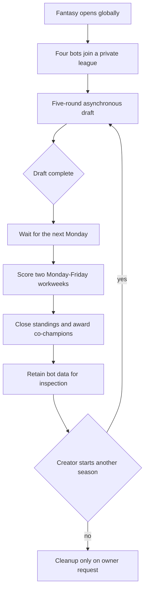
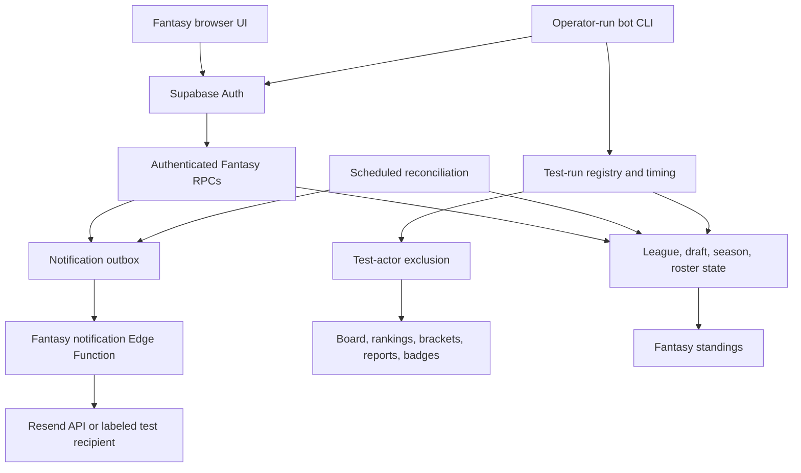
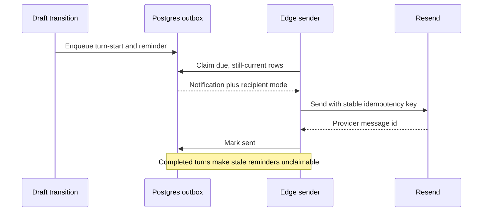
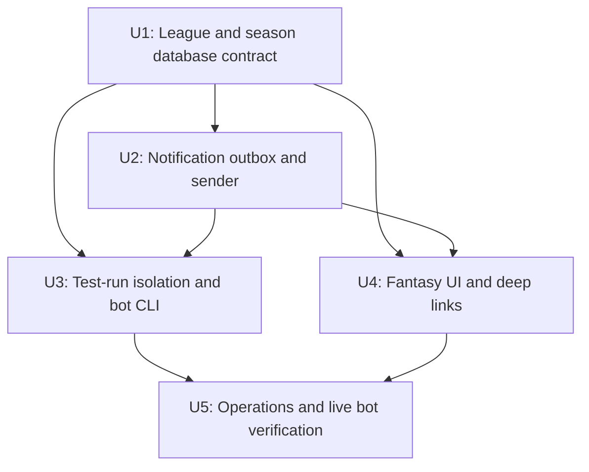

# Fantasy Snack League Opening - Plan

## Goal Capsule

- **Objective:** Open Fantasy Snack League on the unused live site and prove its complete lifecycle with four automated bot managers.
- **Product authority:** This plan supersedes only the Fantasy requirements R43-R55 and flow F6 in `docs/plans/2026-07-10-001-feat-snack-squad-product-overhaul-plan.md`.
- **Authority order:** This plan's Product Contract, then Planning Contract decisions, then current repository conventions and official service contracts.
- **Execution profile:** Database-first, test-first around state and notification boundaries, then frontend and live bot smoke verification.
- **Stop conditions:** Stop before live mutation if Fantasy data or human activity exists unexpectedly, required secrets are missing, or migration history differs from the repository.
- **Tail ownership:** Deployment and the retained bot test are in scope; bot cleanup is prohibited until the owner explicitly requests it before coworker invitations.
- **Open blockers:** None at the product level. Live execution requires linked-project access and a Resend API key.

---

## Product Contract

### Summary

Fantasy Snack League will open globally with private leagues, fixed rosters, asynchronous drafts, and two-workweek seasons.
The first live league will use four bots and compressed timing to verify the lifecycle before any coworker invitation.

### Problem Frame

Fantasy already has a locked monthly-league shape, but the site has no active users and the game has not completed a live season.
Opening it directly to coworkers would combine product launch with first-time verification of drafting, notifications, scoring, completion, and restart behavior.

### Key Decisions

- **Bots prove mechanics before humans enter.** Four automated managers exercise the live product while human rollout remains separate.
- **Leagues persist while seasons are creator-controlled.** A completed league waits until its creator starts another season.
- **Seasons are short and rosters are fixed.** Scoring runs for two Monday-Friday workweeks with no waivers or other roster changes.
- **The catalog grows through use.** Managers add products through search, and curated fallback products are imported only when an auto-pick otherwise cannot complete.
- **Bot data remains inspectable.** Test identities and activity stay in the live project until the owner explicitly requests cleanup before inviting coworkers.

The league lifecycle is:

### Actors

- A1. **League creator bot:** Creates the league, distributes its join code, and starts each season.
- A2. **Manager bot:** Joins the league, manages draft preferences, makes picks, and generates isolated scoring activity.
- A3. **Competition automation:** Advances expired turns, imports curated fallback products when required, scores activity, and completes seasons.
- A4. **Test operator:** Runs the compressed test, inspects delivery and state, and requests cleanup before coworkers are invited.

### Requirements

**League access and lifecycle**

- R1. Fantasy must be available to every authenticated user while the global Fantasy feature is enabled.
- R2. A private league must contain four to eight managers and admit members through its join code until drafting begins.
- R3. Only the league creator may start a season.
- R4. A league must remain idle after a season completes until its creator starts another season.
- R5. A league must not be permanently closed merely because a season ended.

**Roster and draft**

- R6. Each manager must draft five unique snacks from five distinct Snack Squad categories.
- R7. A snack may belong to only one manager within a season but may appear in other leagues or later seasons.
- R8. Each season must randomize manager order and run a five-round snake draft.
- R9. Each turn must use a three-business-hour clock that advances only from 9:00 AM to 5:00 PM Eastern on weekdays.
- R10. A manager may submit a pick at any time while their turn is active.
- R11. Managers must be able to search for and add products during the draft without requiring a pre-seeded catalog.
- R12. An expired turn must select the manager's highest-ranked eligible preference when one exists.
- R13. If no ranked preference is eligible, auto-pick must select an eligible catalog snack using existing activity order.
- R14. If the catalog has no eligible snack, auto-pick must import and select one from a curated fallback pool without relaxing category or exclusivity rules.

**Pick notifications**

- R15. The active manager must receive an email when their turn begins.
- R16. The active manager must receive one reminder email 30 minutes before auto-pick.
- R17. Each pick email must identify the league, state the Eastern deadline, and link directly to the draft.
- R18. A turn completed before its reminder threshold must not send a stale reminder.

**Season and scoring**

- R19. A completed draft must schedule scoring for the first Monday after the final pick.
- R20. A season must score activity during two consecutive Monday-Friday workweeks and must not score either intervening weekend.
- R21. Every qualifying snack log or upvote must earn one point for the manager rostering that snack.
- R22. A manager's own logs and upvotes must not score for that manager's roster.
- R23. Rosters must remain fixed throughout scoring; waivers and replacements are unavailable.
- R24. Every manager tied for the highest final score must receive the Fantasy Champion award as a co-champion.

**Bot test and cleanup**

- R25. The first live league must contain four automated bot managers rather than human testers.
- R26. Bot-generated scoring activity must count in Fantasy while remaining absent from Home, general rankings, brackets, non-Fantasy badges, and weekly reports.
- R27. Pick email delivery for bot accounts must be verified through a delivery-capture mailbox rather than real bot inboxes.
- R28. The controlled mechanics test must use compressed pick and scoring windows without changing the production rules in R9 and R20.
- R29. The bot test must cover manual picks, preference auto-picks, curated fallback auto-picks, both notification times, scoring exclusions, tied winners, completion, and creator-controlled restart.
- R30. Bot identities, leagues, picks, awards, and test activity must remain available after verification until the owner explicitly requests cleanup.
- R31. Cleanup must remove the bot accounts and all bot-created competition and activity data immediately before coworkers are invited.

### Key Flows

- F1. **Run the compressed live test**
  - **Trigger:** The live Fantasy feature is enabled with no existing users.
  - **Actors:** A1, A2, A4
  - **Steps:** Four bots create and join a league, start a compressed draft, exercise manual and expired turns, and enter compressed scoring.
  - **Outcome:** The live product reaches a completed season without manual state repair.
  - **Covered by:** R1-R18, R25, R27-R29

- F2. **Advance an unattended pick**
  - **Trigger:** A bot does not pick before its deadline.
  - **Actors:** A2, A3
  - **Steps:** The system sends the reminder, tries ranked preferences, then the activity-ordered catalog, then the curated fallback pool.
  - **Outcome:** The draft advances with a valid category-distinct roster pick.
  - **Covered by:** R6-R18

- F3. **Complete a season**
  - **Trigger:** The second Friday scoring window ends.
  - **Actors:** A3
  - **Steps:** The system closes scoring, preserves final standings, and awards every manager tied for first.
  - **Outcome:** The league becomes idle and can be restarted only by its creator.
  - **Covered by:** R4-R5, R19-R24

- F4. **Prepare for human use**
  - **Trigger:** The owner explicitly requests cleanup before inviting coworkers.
  - **Actors:** A4
  - **Steps:** The bot identities and all bot-created data are removed, then the production timing and empty-user state are rechecked.
  - **Outcome:** Fantasy remains available without test residue.
  - **Covered by:** R30-R31

### Acceptance Examples

- AE1. **Reminder suppression**
  - **Covers:** R16, R18
  - **Given:** A manager picks more than 30 minutes before the deadline.
  - **When:** The former reminder time arrives.
  - **Then:** No reminder is delivered for that completed turn.

- AE2. **Fallback import**
  - **Covers:** R12-R14
  - **Given:** A timed-out manager has no eligible preference or catalog snack for an open roster category.
  - **When:** Auto-pick runs.
  - **Then:** One curated eligible product is imported and drafted without duplicating a snack or category.

- AE3. **Weekend exclusion**
  - **Covers:** R19-R22
  - **Given:** A season spans two workweeks.
  - **When:** Qualifying activity occurs on the intervening Saturday or Sunday.
  - **Then:** The activity earns no Fantasy points.

- AE4. **Bot activity isolation**
  - **Covers:** R26
  - **Given:** A bot creates an otherwise qualifying log or upvote.
  - **When:** Fantasy and general product totals are evaluated.
  - **Then:** The event scores in Fantasy but does not change any non-Fantasy surface.

- AE5. **Tied season**
  - **Covers:** R24
  - **Given:** Two or more managers share the highest score when scoring closes.
  - **When:** awards are published.
  - **Then:** Every tied manager is recorded as a Fantasy Champion.

- AE6. **Deferred cleanup**
  - **Covers:** R30-R31
  - **Given:** The bot test has passed.
  - **When:** No cleanup request has been made.
  - **Then:** The bot league and its data remain intact for inspection.

### Success Criteria

- The compressed bot season completes the full create, join, draft, notification, scoring, award, and restart lifecycle without manual data repair.
- Delivery capture contains exactly the expected turn-start and eligible reminder messages.
- Every roster satisfies snack exclusivity and five-category diversity.
- Test activity affects Fantasy standings and no non-Fantasy derived surface.
- A cleanup rehearsal can identify all bot-created records without deleting unrelated production data.

### Scope Boundaries

- Human invitations, engagement testing, and coworker rollout are deferred to a separate plan.
- Friday waivers and all other mid-season roster changes are excluded.
- Automatic season restart and automatic recurring schedules are excluded.
- Pre-seeding the live catalog before drafting is excluded.
- Real inboxes for bot accounts are excluded.
- Bot cleanup does not run automatically or immediately after verification.

### Dependencies and Assumptions

- The live site has no active users or production activity when the bot test begins.
- The existing snack search can add canonical products during a draft.
- Outbound transactional email can deliver into a capture mailbox that exposes recipient, subject, body, and delivery time.
- The curated fallback pool contains enough eligible products to finish a four-manager draft while preserving five distinct categories per roster.
- Compressed test controls cannot leak into later human seasons.

### Outstanding Questions

The planning-owned questions are resolved in the Planning Contract. Cleanup execution remains gated by an explicit future owner request.

### Sources

- `docs/plans/2026-07-10-001-feat-snack-squad-product-overhaul-plan.md`
- `docs/pilot-runbook.md`
- `src/screens/FantasyScreen.tsx`
- `src/fantasyStore.ts`
- `supabase/migrations/20260710235803_fantasy_leagues.sql`

**Product Contract preservation:** R1-R31, A1-A4, F1-F4, and AE1-AE6 are unchanged. Only the planning-owned Outstanding Questions were resolved in place.

---

## Planning Contract

### Key Technical Decisions

- **KTD1. Replace the monthly Fantasy contract with one guarded forward-only migration.** Create `supabase/migrations/20260712190000_fantasy_two_week_bot_pilot.sql`; it must stop if any Fantasy league, season, or pick already exists, because changing season identity and removing waivers is safe only while the confirmed live surface is unused.
- **KTD2. Number seasons per league and calculate their windows after the draft.** Remove the month key and waiver structures, lock the league while assigning the next season number, keep scoring dates null during drafting, and populate production dates only after the final pick.
- **KTD3. Keep production and compressed timing in the same state machine.** Production uses the existing three-business-hour clock and the first Monday after drafting; a service-role-only test run supplies shorter durations for its linked league without changing global defaults.
- **KTD4. Keep fallback inventory outside the public catalog until needed.** Store a curated reserve of forty products across five categories, then materialize the first eligible reserve item only when ranked preferences and normal catalog activity cannot fill an auto-pick.
- **KTD5. Queue notifications transactionally and send them from one Edge Function.** Draft transitions create deduplicated start and reminder rows in Postgres; a scheduled Edge Function leases due rows and sends them through Resend with provider and database idempotency so a crashed worker can be retried safely.
- **KTD6. Model bot testing as a named run with real Auth users.** A service-role operator script creates four confirmed password users with synthetic non-company addresses and protected `app_metadata` identifying them as test bots, records their run membership, and drives ordinary authenticated RPCs so access controls and scoring paths are exercised rather than bypassed. The Before User Created hook accepts that service-role-only marker without weakening the company-domain rule for ordinary signups.
- **KTD7. Isolate bot activity by actor identity, not by copying the scoring engine.** Shared board, leaderboard, profile, bracket, report, badge, and unlock calculations exclude test actors; Fantasy standings include test actors only when the season belongs to their test run.
- **KTD8. Use native query parameters for email deep links.** Extend the current state-based shell with `view=fantasy` and `league=<id>` parsing, and preserve that sanitized destination through magic-link sign-in instead of introducing a router dependency for one destination.
- **KTD9. Make cleanup a guarded operator action.** The bot CLI supports inspect and dry-run cleanup, but destructive cleanup requires the exact test-run identifier and an explicit confirmation argument; implementation and verification must not invoke that path against live data.

### High-Level Technical Design

The existing database remains the competition authority. New code adds a notification delivery seam and a test operator seam around it.

Notification delivery is at-least-once internally and effectively once at the provider boundary.

### Data and State Design

- `fantasy_seasons` gains a league-local season number and nullable scoring dates; its active-state uniqueness prevents overlapping drafts or scoring windows in one league.
- `fantasy_test_runs` owns compressed timing, lifecycle state, capture mode, and the retained run identifier.
- `fantasy_test_actors` maps bot users to one run and cascades with Auth deletion.
- `fantasy_fallback_products` holds the curated reserve without exposing reserve rows as ordinary snacks.
- `fantasy_notifications` records kind, pick identity, due time, intended recipient, delivery target, attempts, and provider result with a unique season/pick/kind key.
- Existing `snack_logs` and `log_upvotes` remain the scoring source; test identity filters determine which consumers may see each event.

### Scheduling and Timing

- Production scoring starts at 12:00 AM Eastern on the first Monday strictly after the final pick and ends at 12:00 AM Eastern on the Saturday after the second Friday.
- Production standings ignore Saturday and Sunday events inside that outer interval.
- Production reminders are due 30 minutes before the current pick deadline.
- The retained bot run uses a two-minute pick clock, a one-minute reminder threshold, and a ten-minute scoring window. These values live only on the named test run.
- The database reconciler remains the state-transition authority. The notification sender runs independently so a mail outage cannot block picks or season completion.

### Security and Failure Boundaries

- Only the service role may create test runs, register test actors, inspect all run artifacts, claim notification rows, or request cleanup data.
- The Before User Created hook permits non-company bot addresses only when protected Auth `app_metadata` carries the test-bot marker; public `user_metadata`, email shape, and browser signup inputs cannot grant the exception.
- Bot credentials are generated in memory for one run and are never committed, written to logs, or returned by database functions.
- Browser callers retain only the server-clock RPC wrappers; timestamp-override and test-mode controls remain revoked from authenticated and anonymous roles.
- Failed email delivery leaves a retryable outbox row and never rolls back a completed pick.
- A sender claim has a short lease; an expired lease returns to the retry pool if the worker exits before recording delivery.
- The sender retries a bounded number of times and records the final provider error for operator inspection.
- Cleanup refuses to proceed when the run includes an unmarked user, a non-test league member, or a bot-created snack referenced by non-test activity.
- Resend keys and Supabase secret/service-role keys remain server-only. The live bot CLI reads them from the operator environment.

### Sequencing

### System-Wide Impact

- **Data lifecycle:** The migration removes empty waiver structures and replaces monthly season identity. Test cleanup later crosses Auth, profiles, activity, Fantasy state, notification history, and bot-created catalog rows.
- **Shared calculations:** Bot exclusion must be applied consistently to every non-Fantasy consumer of snack logs and upvotes, including contest seeding and pilot metrics.
- **External delivery:** Resend and the scheduled Edge Function become operational dependencies for pick email, but gameplay remains available during email failure.
- **Navigation:** Desktop keeps a Fantasy destination; mobile continues to place Fantasy under Bracket as required by the parent Product Contract.
- **Operations:** The retained bot run is intentional live data until a separately authorized cleanup action.

### Risks and Mitigations

| Risk | Mitigation | Verification |
|---|---|---|
| A delayed reconciler cascades several auto-picks and produces stale mail | Claim notifications only for the current pick and use unique pick/kind rows | Database tests advance time across multiple expired turns |
| Bot events leak into shared culture surfaces | Centralize test-actor predicates and cover each derived function with pgTAP | Isolation matrix asserts Fantasy inclusion and non-Fantasy exclusion |
| Test timing affects a future human league | Store overrides on the test run and reject test timing for unlinked leagues | Production and test seasons run side by side in database tests |
| Resend retries duplicate email | Combine outbox uniqueness, claim state, and Resend idempotency keys | Edge tests replay the same notification and observe one send |
| The sender succeeds externally but exits before recording success | Reclaim expired leases and reuse the same provider idempotency key within the retry window | Edge tests replay a leased row after simulated worker exit |
| Fallback inventory runs out or repeats a category | Reserve eight products in each of five categories and lock selection | Eight-manager exhaustion test completes forty legal picks |
| Cleanup removes non-test data | Default to inspect/dry-run and block on any non-test reference | CLI and database tests exercise refusal paths |
| Destructive season reshaping meets unexpected live data | Migration aborts before drops or constraint changes | Migration precondition is documented and checked before push |

### Dependencies and Prerequisites

- Linked Supabase project access with permission to apply migrations, manage Vault secrets, set Edge Function secrets, and deploy functions.
- A Resend API key; bot Auth addresses are synthetic non-company identities, bot delivery targets use separate labeled `delivered+...@resend.dev` recipients, and future human delivery requires a verified sender domain.
- Existing `USDA_API_KEY`, because normal draft search remains available even though fallback selection does not make a live USDA call.
- The live preflight must confirm zero Fantasy rows and no human activity before U1 is deployed.

### Sources and Research

- Existing Fantasy state machine and permissions: `supabase/migrations/20260710235803_fantasy_leagues.sql`
- Existing database contract tests: `supabase/tests/database/fantasy_leagues.test.sql`
- Existing authenticated Edge Function pattern: `supabase/functions/snack-metadata/index.ts`
- Existing frontend state and snack import path: `src/screens/FantasyScreen.tsx`, `src/fantasyStore.ts`, `src/snackMetadata.ts`
- Existing local demo data is not a live provisioning path: `supabase/seed.sql`
- Supabase scheduled Edge Function guidance: https://supabase.com/docs/guides/functions/schedule-functions
- Supabase server-side Auth user creation: https://supabase.com/docs/reference/javascript/auth-admin-createuser
- Resend send API and idempotency: https://resend.com/docs/api-reference/emails/send-email and https://resend.com/docs/dashboard/emails/idempotency-keys
- Resend labeled test recipients: https://resend.com/docs/dashboard/emails/send-test-emails

---

## Implementation Units

### U1. Replace the Fantasy league and season database contract

- **Goal:** Move Fantasy from monthly seasons with waivers to persistent leagues with creator-started, two-workweek seasons and guaranteed auto-pick completion.
- **Requirements:** R2-R14, R19-R24; F2-F3; AE2-AE3, AE5
- **Dependencies:** None
- **Files:** `supabase/migrations/20260712190000_fantasy_two_week_bot_pilot.sql`, `supabase/tests/database/fantasy_leagues.test.sql`
- **Approach:** Add the empty-data precondition first, replace month identity with league-local season numbering, drop waiver RPCs and storage, schedule scoring after the last pick, exclude weekends in standings, preserve co-champion insertion, and add a locked curated fallback reserve. Keep the existing security-definer and server-clock wrapper pattern.
- **Execution note:** Expand the pgTAP contract before replacing the existing functions; the schema change is the highest-risk and most reusable part of the work.
- **Patterns to follow:** Time-injectable internal functions plus authenticated server-clock wrappers in `supabase/migrations/20260710235803_fantasy_leagues.sql`; transactional catalog locking in `supabase/migrations/20260711143152_harden_snack_integrity.sql`.
- **Test scenarios:**
  - A four-manager and an eight-manager league each receive unique snake positions and complete five rounds with no duplicate snack or per-manager category.
  - The creator may start a new season only after the prior one completes; a non-creator and an overlapping start are rejected.
  - A final pick on Monday, Friday, and Sunday schedules the next strictly-future Monday in Eastern time and a second-Friday close.
  - Covers AE3. Weekend logs and upvotes inside the outer scoring interval earn zero points, while both adjacent weekdays score.
  - A manager's own log and upvote remain excluded from that manager's roster score.
  - Covers AE2. Ranked preference, activity-ordered catalog fallback, and curated reserve fallback each produce the expected legal auto-pick.
  - An eight-manager draft with an otherwise empty catalog can consume forty fallback products without exhausting the reserve.
  - Covers AE5. Every first-place tie receives a champion tenure and a lower score does not.
  - Authenticated roles cannot invoke timestamp-injected helpers, fallback materialization, reconciliation, or removed waiver functions.
  - The migration stops before mutation when any Fantasy league, season, or pick exists.
- **Verification:** The database contract passes from a no-seed reset, lint reports no public-schema warnings, and the new schema exposes no waiver API.

### U2. Add durable pick notifications

- **Goal:** Deliver turn-start and pre-auto-pick emails without coupling external mail availability to draft transactions.
- **Requirements:** R15-R18, R27; F1-F2; AE1
- **Dependencies:** U1
- **Files:** `supabase/migrations/20260712190100_fantasy_notifications.sql`, `supabase/tests/database/fantasy_notifications.test.sql`, `supabase/functions/fantasy-notifications/index.ts`, `supabase/functions/fantasy-notifications/index.test.ts`, `supabase/config.toml`, `supabase/functions/.env.example`, `package.json`
- **Approach:** Enqueue both notification kinds from the draft state transition, cancel or invalidate the reminder when the turn changes, claim due rows through a service-role-only RPC, and send through Resend with a stable idempotency key. Route test-run messages to labeled Resend test recipients while retaining the intended bot identity in delivery metadata.
- **Execution note:** Prove outbox idempotency and stale-reminder suppression before making the external request path.
- **Patterns to follow:** Fetch-based, dependency-free Edge handling and environment lookup in `supabase/functions/snack-metadata/index.ts`; official Supabase cron-to-Edge and Resend idempotency guidance in Sources and Research.
- **Test scenarios:**
  - Starting a draft creates exactly one turn-start row and one future reminder row for pick one.
  - Completing a pick creates the next turn's rows and makes the previous reminder unclaimable.
  - Covers AE1. A pick completed before the threshold never produces a reminder send.
  - Repeated reconciliation and repeated sender invocation do not create or deliver duplicates.
  - A provider timeout leaves the row retryable; a later success records one provider message ID.
  - A worker exit after provider acceptance leaves an expired lease that retries with the same idempotency key and records one delivery.
  - A permanent provider failure stops after the bounded attempt count and remains inspectable.
  - Test-run delivery uses distinct labeled capture recipients; a normal league uses the manager's Auth email.
  - Missing or invalid service credentials reject sender invocation without exposing queued payloads.
- **Verification:** Database and Edge tests prove queueing, claiming, retries, capture routing, and duplicate suppression; a local sender run records the expected provider request without exposing secrets.

### U3. Add retained bot-run automation and activity isolation

- **Goal:** Provision four real bot users, drive a compressed live season through ordinary authenticated calls, retain its artifacts, and provide a safe cleanup path for later authorization.
- **Requirements:** R25-R31; F1, F4; AE4, AE6
- **Dependencies:** U1, U2
- **Files:** `supabase/migrations/20260712190200_fantasy_bot_runs.sql`, `supabase/tests/database/fantasy_bot_runs.test.sql`, `scripts/fantasy-bot-test.ts`, `scripts/fantasy-bot-test.test.ts`, `package.json`
- **Approach:** Add run and actor registries with service-role-only management, extend the Auth hook for a protected test-bot `app_metadata` marker, apply actor exclusion to every shared activity consumer, and scope Fantasy scoring to the season's run. Implement one CLI with `run`, `inspect`, and guarded `cleanup` modes; `run` creates confirmed Auth users with synthetic non-company addresses and generated passwords, signs them in, drives manual and expired turns, creates scoring events, validates co-champions, and leaves the run intact.
- **Execution note:** Build the isolation matrix and cleanup refusal tests before the live operator path; bot data safety matters more than CLI polish.
- **Patterns to follow:** Auth fixtures and claim switching in `supabase/tests/database/fantasy_leagues.test.sql`; server-only service-role handling in `supabase/functions/snack-metadata/index.ts`; the repository's `tsx` assertion-test style.
- **Test scenarios:**
  - The service role can register a four-bot run; browser roles cannot read or mutate test-run controls.
  - The Auth hook accepts a non-company address carrying the protected test-bot `app_metadata` marker and rejects the same address when the marker is absent or supplied only as public `user_metadata`.
  - A test actor can join only its run's test league, and an ordinary user cannot join that league.
  - Covers AE4. Bot logs and upvotes score in the linked Fantasy season but do not appear in board feed, leaderboard, profile aggregates, bracket seeding, weekly reports, non-Fantasy badges, or unlock metrics.
  - A normal Fantasy season excludes retained bot activity even when it rosters the same snack.
  - The compressed run exercises a manual pick, preference auto-pick, curated fallback auto-pick, start email, reminder email, scoring, co-champion completion, and creator restart.
  - Covers AE6. `inspect` reports a completed retained run without modifying it.
  - Cleanup defaults to dry-run and refuses an absent or mismatched confirmation token.
  - Cleanup refuses when any run artifact is referenced by non-test activity or any league member is not marked for the run.
  - Confirmed cleanup removes run-owned activity and catalog rows before deleting Auth users, leaving unrelated rows unchanged.
- **Verification:** The isolation matrix passes in pgTAP, CLI assertions pass without a live project, and a local-stack run completes and remains inspectable until cleanup is deliberately invoked.

### U4. Update Fantasy navigation, states, and deep links

- **Goal:** Make the existing interface accurately represent two-workweek seasons, fixed rosters, creator restarts, and email entry links.
- **Requirements:** R1-R5, R10-R11, R17, R23-R24; F1-F3
- **Dependencies:** U1, U2
- **Files:** `src/App.tsx`, `src/components/AppShell.tsx`, `src/screens/ContestsScreen.tsx`, `src/screens/FantasyScreen.tsx`, `src/fantasyStore.ts`, `src/fantasyStore.test.ts`, `src/styles.css`
- **Approach:** Remove waiver code and monthly copy, map the revised season fields, add explicit drafting/scheduled/active/complete presentations, let creators start the next season from a completed league, and select a league from the email query string. Keep Fantasy in desktop navigation and route mobile users through Bracket rather than adding a fifth bottom destination.
- **Patterns to follow:** Existing state-based navigation in `src/App.tsx`, accessible status/error regions in `src/screens/FantasyScreen.tsx`, and typed RPC mapping in `src/fantasyStore.ts`.
- **Test scenarios:**
  - Revised overview data maps season number, scoring dates, pick deadline, and complete state without month or waiver fields.
  - A Fantasy deep link opens the Fantasy surface and selects the addressed member league after authentication.
  - An unauthenticated Fantasy deep link survives the magic-link request and callback without retaining unrelated query parameters.
  - An invalid or inaccessible league query falls back to the user's first league and shows no broken state.
  - Drafting shows picker and Eastern deadline; scheduled shows the next Monday; active shows standings and fixed roster; complete shows co-champions and creator-only restart.
  - Waiver controls and monthly language are absent at desktop, tablet, and mobile widths.
  - Desktop shows Fantasy as its own destination; mobile reaches Fantasy from Bracket with four bottom destinations preserved.
  - Keyboard focus, loading, retry, empty, and error states remain usable.
- **Verification:** Store assertions, typecheck, and production build pass; browser smoke checks confirm the affected desktop and mobile flows with no console errors.

### U5. Deploy safely and run the retained live bot season

- **Goal:** Make the new email/test dependencies reproducible, deploy compatible schema and functions, run the live bot test, and leave its evidence intact.
- **Requirements:** R1, R25-R31; F1, F4; Success Criteria
- **Dependencies:** U2, U3, U4
- **Files:** `README.md`, `docs/auth-setup.md`, `docs/pilot-runbook.md`
- **Approach:** Document Resend sender and capture setup, Edge/Vault secrets, deployment order, zero-data preflight, rollback, bot run/inspection, and the prohibition on cleanup without owner authorization. Update CI only where new test files are not already reached by existing commands.
- **Execution note:** Treat this as smoke-first operational work: verify live preconditions and restore paths before applying schema or enabling Fantasy.
- **Patterns to follow:** Coordinated migration/frontend rollout and rollback guidance in `docs/pilot-runbook.md`; server-only secret guidance in `docs/auth-setup.md`; current GitHub verification jobs in `.github/workflows/verify.yml`.
- **Test scenarios:**
  - Hosted preflight confirms migration ancestry, zero Fantasy rows, no human activity, configured USDA, Resend, Edge, and Vault secrets, and a healthy reconciler.
  - Schema, notification function, and frontend are deployed as one compatible release before the feature flag is enabled.
  - The live bot command creates exactly four test actors and one test league, completes the compressed lifecycle, and exits without cleanup.
  - Inspection confirms expected notifications, legal rosters, isolated scoring, co-champions, completed state, and a creator-startable next season.
  - Disabling the Fantasy flag hides entry while preserving the retained test run.
  - A failed deployment can restore the prior frontend and disable Fantasy without reversing populated migrations.
- **Verification:** CI is green, linked migration history matches, deployed functions report active, the live retained-run inspection satisfies every success criterion, and no cleanup command has run.

---

## Verification Contract

| Gate | Command or action | Proves | Units |
|---|---|---|---|
| Type safety | `npm.cmd run typecheck` | Revised RPC types and UI state compile | U4 |
| Assertion tests | `npm.cmd test` | Store, Edge sender, metadata, and bot CLI helpers behave as planned | U2-U4 |
| Production build | `npm.cmd run build` | The browser bundle remains deployable | U4-U5 |
| Clean database apply | `npm.cmd exec -- supabase db reset --local --yes --no-seed` | All migrations apply from zero without demo data | U1-U3 |
| Database contracts | `npm.cmd exec -- supabase test db --local supabase/tests/database` | Season, notification, isolation, and cleanup contracts hold | U1-U3 |
| Database lint | `npm.cmd exec -- supabase db lint --local --schema public --level warning --fail-on warning` | New functions, grants, and schema are lint-clean | U1-U3 |
| Local bot smoke | `npm.cmd run fantasy:bot -- run --local` followed by `inspect` | Four bots complete and retain the compressed lifecycle | U1-U4 |
| Browser smoke | Desktop and mobile inspection against the local retained run | Navigation, deep links, states, focus, and console remain correct | U4 |
| Hosted preflight | Linked migration list, zero-data queries, secret presence, and reconciler history | Live mutation is safe to begin | U5 |
| Hosted bot smoke | `npm.cmd run fantasy:bot -- run --live` followed by `inspect` | The actual live lifecycle and delivery capture satisfy the Product Contract | U5 |

The hosted bot smoke is the release gate. Cleanup is not part of verification and must not run during implementation.

---

## Definition of Done

### Global

- The Product Contract remains traceable and unchanged except for resolved planning questions.
- Production leagues use two Monday-Friday scoring weeks, creator-controlled restart, fixed rosters, co-champions, and no waiver surface or API.
- Turn-start and eligible reminder emails are durable, deduplicated, retryable, and deep-link into the addressed league.
- Test actors exercise ordinary Auth, draft, catalog, activity, and scoring paths while remaining absent from every non-Fantasy surface.
- The live four-bot run completes successfully and remains available for inspection.
- Production timing, normal user paths, and the global feature flag remain reversible without deleting retained history.
- Documentation names every required secret, preflight, deployment, inspection, rollback, and future cleanup guard.
- No abandoned migrations, unused helpers, duplicate timing paths, or experimental bot code remain in the diff.

### Per Unit

- **U1:** New database contracts pass at four- and eight-manager boundaries, and monthly/waiver behavior is absent.
- **U2:** Queue and sender tests prove both notification times, stale suppression, retries, and idempotency.
- **U3:** Isolation and cleanup-safety tests pass, and the operator CLI retains rather than cleans the completed run.
- **U4:** Fantasy states and navigation match the Product Contract on desktop and mobile.
- **U5:** CI, deployment verification, and the retained live bot inspection are green; cleanup remains unexecuted.
