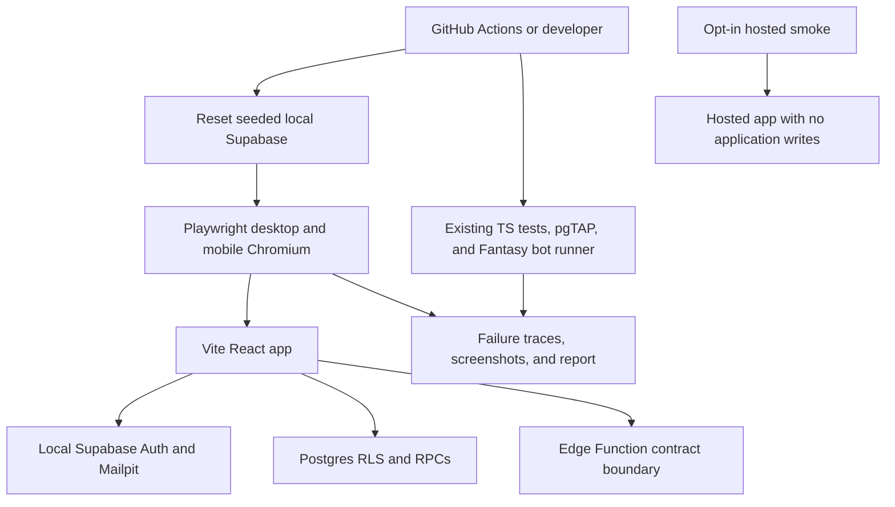
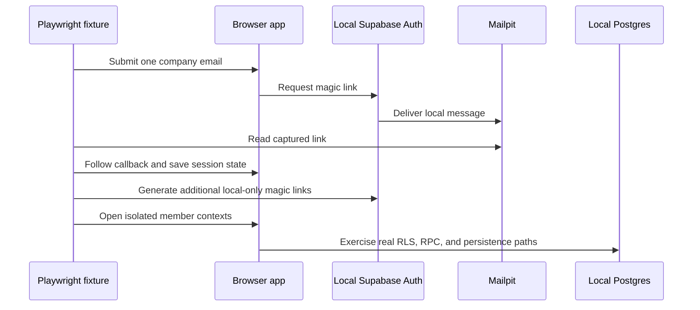

# Snack Squad End-to-End Confidence - Plan

## Goal Capsule

- **Objective:** Add a repeatable end-to-end confidence system that proves Snack Squad's shipped browser journeys, Supabase boundaries, and competition lifecycles work together as scoped.
- **Product authority:** The confirmed testing scope in this plan, then `README.md`, the current application, `docs/plans/2026-07-10-001-feat-snack-squad-product-overhaul-plan.md`, and the superseding Fantasy contract in `docs/plans/2026-07-12-001-feat-fantasy-snack-league-opening-plan.md`.
- **Execution profile:** Test-first harness work against disposable local Supabase data, followed by a non-destructive hosted smoke path.
- **Stop conditions:** Stop before using a production service-role key, mutating hosted application data, weakening RLS/Auth controls for tests, or silently choosing behavior where the current product contract and reachable UI conflict.
- **Tail ownership:** Implementation owns the harness, CI integration, coverage documentation, the first full green local run, and an explicit report of product defects or scope mismatches found by the suite.

---

## Product Contract

### Summary

Snack Squad will gain browser-level proof for authentication, daily snack activity, multi-user privacy and reactions, profiles and corrections, the weekly bracket, Fantasy, responsive navigation, and hosted availability.
State-changing coverage runs against a reset local stack; hosted checks remain non-destructive.

### Problem Frame

The repository has strong assertion-based TypeScript tests, Edge Function tests, pgTAP coverage, and a retained Fantasy bot runner.
Those layers do not prove that a user can traverse the browser, magic-link callback, Supabase session, RLS policies, RPCs, UI refreshes, and multiple user contexts as one connected system.

The current pilot runbook is largely manual, which makes broad regression checks slow and makes it easy to overstate confidence after only unit, database, or build gates pass.
The end-to-end layer must close that gap without duplicating the database suite or turning production into a test fixture.

### Actors

- A1. An unauthenticated visitor requesting a company magic link.
- A2. An authenticated member logging snacks and participating in shared activity.
- A3. A moderator reviewing canonical snack corrections.
- A4. A Fantasy league creator or manager moving through a draft and season.
- A5. A developer or CI runner verifying a disposable local environment.
- A6. An operator running non-destructive checks against the hosted app.

### Requirements

**Coverage and environment**

- R1. The suite must trace every current user-facing capability to browser E2E, existing lower-level automation, hosted smoke, or an explicit manual-only reason.
- R2. All state-changing browser journeys must run against a disposable local Supabase stack reset to deterministic seed data.
- R3. Hosted smoke tests must avoid application-data writes and must never require a production service-role key.
- R4. Local browser tests must use the real app, Supabase Auth, Postgres/RLS, RPCs, and persisted state; only third-party network responses may be replaced at the application boundary for determinism.
- R5. Shared-state tests must run predictably with one CI worker, isolated browser contexts, and test-owned records rather than depending on test order.

**Authentication and security**

- R6. Browser coverage must prove company-email validation, one real local Mailpit magic-link delivery, callback completion, session refresh, sign-out, and Fantasy deep-link preservation.
- R7. Additional local test identities may use admin-generated magic links, but the service-role credential must remain in Node-side setup and must never reach browser storage, page code, reports, or hosted smoke.
- R8. Multi-user coverage must prove that private log rows stay owner-only while board entries, aggregate profiles, badges, reactions, rankings, and competition state remain appropriately shared.

**Daily activity and moderation**

- R9. Browser coverage must prove local catalog search, a deterministic remote-result handoff, remote-search failure fallback, manual snack entry, daily logging, and separate entries for different users of the same snack.
- R10. Browser coverage must prove self-upvote prevention, coworker upvote and removal, board refresh, leaderboard refresh, and public-profile navigation.
- R11. Browser coverage must prove same-day replace and delete behavior, including removal of unsettled reactions and derived totals where the product contract requires it.
- R12. Browser coverage must prove profile editing, favorite selection, private-history visibility, member correction submission, moderator approval or rejection, and the updated canonical value.

**Bracket and Fantasy**

- R13. Browser coverage must prove shared bracket nominations, co-ownership, matchup vote replacement, and disabled voting after resolution.
- R14. Browser coverage must prove Fantasy availability, create/join/start permissions, join-code handoff, dedicated navigation, refresh-safe deep links, fixed roster categories, a valid manual pick, and saved auto-pick preferences.
- R15. Full Fantasy timing, auto-pick, notification, scoring, tie, completion, isolation, and restart proof must reuse the retained bot runner and existing database/Edge Function tests rather than reproduce the entire clock in browser code.
- R16. Browser tests must render representative Fantasy lobby, drafting, scheduled, active, complete, and restart states after those states are prepared through existing trusted test seams.

**Responsive, accessibility, and diagnostics**

- R17. The critical browser journeys must run in desktop and mobile-sized Chromium projects with role- or label-based selectors.
- R18. Coverage must check keyboard reachability, visible focus, skip navigation, reduced-motion behavior, primary navigation, and horizontal overflow on critical screens without adding pixel snapshots or another accessibility dependency.
- R19. CI failures must retain a Playwright report and failure diagnostics while keeping successful runs lightweight.

**Operational truth**

- R20. The repository must expose clear local E2E and hosted-smoke commands and document their prerequisites, mutation boundaries, and covered flows.
- R21. The implementation must record scope mismatches found during coverage rather than silently reintroduce retired features or weaken assertions to make the suite green.
- R22. A current product defect with unambiguous expected behavior may be fixed while implementing the suite; a disputed or newly invented behavior must stop for product direction.

### Key Flows

- F1. **Enter by magic link**
  - **Trigger:** A1 submits an eligible company email.
  - **Actors:** A1, A5.
  - **Steps:** Request the link, read the captured local message, follow the callback, refresh the authenticated page, and sign out.
  - **Outcome:** The same local Auth path used by the app creates and restores a valid browser session.

- F2. **Log and react across two members**
  - **Trigger:** A2 searches for or manually enters a snack.
  - **Actors:** Two A2 browser contexts.
  - **Steps:** Log the snack, observe the shared board from the other context, upvote it, inspect the leaderboard and public profile, then replace or delete the open log.
  - **Outcome:** Shared and private state update across users while ownership boundaries hold.

- F3. **Correct canonical metadata**
  - **Trigger:** A2 finds incorrect snack metadata.
  - **Actors:** A2, A3.
  - **Steps:** Submit a correction, review it in the moderator context, and observe the result in member-facing UI.
  - **Outcome:** Members propose and moderators decide without granting members direct edit authority.

- F4. **Participate in the weekly bracket**
  - **Trigger:** A nomination or matchup is open.
  - **Actors:** Multiple A2 contexts.
  - **Steps:** Nominate the same snack, observe co-ownership, cast and replace a vote, then view a resolved matchup.
  - **Outcome:** Bracket ownership and voting match the database-enforced rules.

- F5. **Open and exercise Fantasy**
  - **Trigger:** Fantasy is enabled.
  - **Actors:** A4, A5.
  - **Steps:** Create and join a league, enforce creator-only start, navigate by deep link, make or queue eligible picks, run the existing compressed system lifecycle, and render the resulting states.
  - **Outcome:** Browser behavior and the retained lifecycle runner prove complementary parts of the same feature.

- F6. **Check the hosted deployment**
  - **Trigger:** A6 supplies an approved hosted base URL and, when available, a dedicated read-only test session.
  - **Actors:** A6.
  - **Steps:** Load the app, verify the auth shell or authenticated navigation, refresh deep links, inspect response/security basics, and avoid mutation controls.
  - **Outcome:** Deployment and configuration drift are detected without changing production data.

### Acceptance Examples

- AE1. **Ineligible signup.** Given a visitor enters a non-company email, when they submit the form, then the UI rejects it and no Auth user is created.
- AE2. **Real local magic link.** Given an eligible company address requests a link, when the test follows the link captured in Mailpit, then the user reaches the authenticated app, survives refresh, and can sign out.
- AE3. **Private and shared state.** Given Alex and Jordan are authenticated separately, when Alex logs a snack, then Jordan sees the board entry but cannot see Alex's private log history; Jordan may upvote it while Alex cannot self-upvote.
- AE4. **Open-log replacement.** Given Alex's same-day entry has a coworker upvote, when Alex replaces or deletes it, then the old shared entry and unsettled reaction no longer contribute to the visible totals.
- AE5. **Moderated correction.** Given Jordan proposes a corrected snack name, when the moderator approves it, then Jordan never receives direct edit controls and the canonical name refreshes in user-facing state.
- AE6. **Bracket ownership and votes.** Given two users nominate the same snack, when nominations are loaded, then one entry shows both owners; an open matchup permits one replaceable vote and a resolved matchup rejects further voting.
- AE7. **Fantasy reachability.** Given Fantasy is enabled, when a user opens desktop or mobile navigation and refreshes a league deep link, then the dedicated Fantasy surface and selected league remain reachable.
- AE8. **Fantasy lifecycle.** Given the local bot runner starts a controlled run, when it advances drafting and scoring, then the run completes with fixed-category rosters, isolated bot activity, the expected winners, and creator-controlled restart while browser state renders the resulting season correctly.
- AE9. **Hosted safety.** Given only the hosted-smoke command and approved read-only session, when the smoke project runs, then it verifies reachability and navigation without creating, changing, or deleting application records.

### Success Criteria

- Pull requests run the local Chromium E2E gate after a seeded Supabase reset.
- A failed browser flow produces enough retained evidence to diagnose the failing step without rerunning headed first.
- The coverage document maps every confirmed capability to a test layer and names any remaining manual-only or missing surface.
- The first implementation run ends with all agreed automated gates green or with an explicit product blocker instead of muted or skipped failures.

### Scope Boundaries

**Included**

- The current Vite/React app, local Supabase Auth/Postgres/RPC/RLS behavior, bracket and Fantasy flows, Edge Function contracts, responsive navigation, and non-destructive hosted smoke.
- Focused in-scope bug fixes discovered by the new suite when expected behavior is already authoritative.

**Deferred to follow-up work**

- Firefox, WebKit, and branded-browser matrices until usage or a browser-specific regression justifies their CI cost.
- Load, soak, visual-regression, and performance-budget suites.
- Automated production mutations, production cron time travel, and synthetic production-data cleanup.
- Broad automated accessibility scanning; this plan uses native roles, keyboard assertions, reduced-motion emulation, and layout checks.

**Known scope mismatches to record, not silently build**

- CSV export was included in the confirmed audit scope, but the current application has no reachable export code or UI. The coverage document must mark it missing and defer any product restoration decision.
- Enabled Fantasy has a dedicated desktop tab but no current mobile entry point. AE7 intentionally exposes this as a release-relevant mismatch; the suite must not hide it by navigating directly only.
- Friday report data exists below the UI, but the current contest screen does not render a report feed. Existing database coverage remains authoritative until product direction adds or confirms a user-facing report surface.

---

## Planning Contract

### Key Technical Decisions

- KTD1. **Use Playwright Test as the single new E2E dependency.** It supplies browser control, projects, web-server lifecycle, role locators, traces, screenshots, and HTML reports without adding a separate assertion, server, or accessibility framework.
- KTD2. **Run full mutations locally and hosted smoke non-destructively.** (session-settled: user-approved — chosen over full hosted E2E mutations: disposable local state proves write flows without risking pilot data.)
- KTD3. **Keep external services deterministic in the local gate.** (session-settled: user-approved — chosen over making every CI run depend on USDA and email delivery: app-owned contracts stay repeatable while optional live smoke covers configuration drift.)
- KTD4. **Start with desktop and mobile Chromium only.** (session-settled: user-approved — chosen over an immediate three-engine browser matrix: the first suite targets the app's real responsive split with lower runtime and maintenance cost.)
- KTD5. **Exercise one real Mailpit magic-link delivery and generate additional local magic links in Node-side setup.** This proves the email path once, avoids the local email rate limit for every test user, and keeps multi-user setup fast.
- KTD6. **Reuse the seed and existing system runners instead of adding a second scenario framework.** Browser fixtures create only test-owned deltas; pgTAP and `scripts/fantasy-bot-test.ts` remain authoritative for clock-heavy database state.
- KTD7. **Run shared-state E2E with one CI worker.** Official Playwright guidance recommends serial CI execution for stability when tests mutate shared server state; distinct browser contexts still prove concurrent identities.
- KTD8. **Use accessible selectors before test IDs.** Roles, labels, names, and visible states make the tests double as basic accessibility checks; add a test ID only where no stable user-facing selector exists.
- KTD9. **Do not use page objects.** The app has five compact screens, so direct fixtures plus focused specs are shorter and easier to debug than a parallel abstraction layer.
- KTD10. **Treat red E2E results as evidence, not harness noise.** Retries may capture a first-retry trace, but a test that only passes on retry remains a flake to fix before completion.

### High-Level Technical Design

The local gate extends the existing verification stack rather than replacing it.

Authentication setup proves the real flow once and then creates isolated sessions without resending mail for every context.

### Sequencing

1. Establish the Playwright configuration, local prerequisites, and CI lifecycle.
2. Build trusted local authentication/session fixtures and prove the Auth boundary.
3. Add the core multi-user and moderation journey.
4. Add bracket and Fantasy UI coverage while reusing the existing lifecycle runner.
5. Add hosted smoke, finalize coverage mapping, run the full verification contract, and triage real defects.

### System-Wide Impact

- **Auth and secrets:** Node-side fixtures need the local service-role key; reports and browser state must be reviewed to ensure it is never serialized.
- **Database lifecycle:** E2E runs require seeded resets, while existing pgTAP CI continues to reset with `--no-seed`; the two paths must stay separate.
- **CI runtime:** A browser install and seeded Supabase job add runtime, so the first gate stays Chromium-only and single-worker.
- **Feature-state setup:** The demo seed does not guarantee that Fantasy is enabled for every run. Node-side local fixtures may prepare `feature_flags` and scenario state, but browser tests must still consume that state through authenticated public APIs and UI.
- **External integrations:** USDA and outbound email remain covered by focused Edge Function tests plus optional live checks rather than nondeterministic PR traffic.
- **Product truth:** The coverage matrix will make missing mobile Fantasy, CSV export, and Friday-report surfaces visible to release decisions.

### Risks and Dependencies

- **Local email limits:** Repeated OTP sends can exhaust the configured local rate limit. Mitigation: one Mailpit delivery, then admin-generated local links for extra identities.
- **Seed collisions:** The demo seed contains substantial activity. Mitigation: reset before the job, use test-owned names/records, and avoid order-dependent assertions.
- **Time-based competition rules:** Waiting for real bracket and Fantasy clocks would make CI unusable. Mitigation: use existing trusted reconciliation and bot seams, then assert resulting UI states.
- **Credential leakage:** Storage state and traces can capture sensitive data. Mitigation: local-only credentials, ignored auth-state files, failure-only diagnostics, and no production service role.
- **Uncompiled test code:** The current `tsconfig.json` includes only `src`. Mitigation: extend the existing strict typecheck boundary to cover Playwright configuration and E2E files instead of relying only on runtime transpilation.
- **Hosted drift:** A read-only smoke cannot prove production writes. Mitigation: keep the coordinated manual pilot runbook for production mutation proof and state that boundary clearly.

### Sources and Research

- `README.md` for the current product, guardrails, and verification commands.
- `docs/auth-setup.md` and `docs/pilot-runbook.md` for local Mailpit, hosted Auth, pilot smoke, and rollback constraints.
- `src/App.tsx`, `src/components/AppShell.tsx`, and `src/screens/` for the reachable browser flows and responsive navigation.
- `src/snackStore.ts`, `src/snackMetadata.ts`, `src/contestStore.ts`, `src/fantasyStore.ts`, and `src/profile.ts` for browser-to-Supabase seams.
- `supabase/tests/database/`, `supabase/functions/`, and `scripts/fantasy-bot-test.ts` for lower-layer coverage that E2E should reuse.
- [Playwright web-server guidance](https://playwright.dev/docs/test-webserver), [authentication guidance](https://playwright.dev/docs/auth), [projects](https://playwright.dev/docs/test-projects), and [CI guidance](https://playwright.dev/docs/ci).
- [Supabase local testing and Mailpit guidance](https://supabase.com/docs/guides/local-development/cli/testing-and-linting) and [local development overview](https://supabase.com/docs/guides/local-development).

---

## Implementation Units

### U1. Establish the E2E harness and CI gate

- **Goal:** Add the minimal Playwright foundation and make a seeded local browser run reproducible in CI and on a developer machine.
- **Requirements:** R1-R5, R17-R20; KTD1-KTD4, KTD7-KTD10.
- **Dependencies:** None.
- **Files:** `package.json`, `package-lock.json`, `tsconfig.json`, `.gitignore`, `playwright.config.ts`, `.github/workflows/verify.yml`, `e2e/fixtures.ts`, `e2e/harness.spec.ts`.
- **Approach:** Add `@playwright/test`, extend strict TypeScript coverage to the Playwright files, configure desktop/mobile Chromium projects, use the Vite web-server lifecycle, set one-worker CI behavior, retain failure diagnostics, and validate the local Supabase environment. Keep Supabase start/reset in the surrounding workflow rather than hiding it in a custom process manager.
- **Execution note:** Start with a failing harness smoke that cannot pass unless the seeded local stack and Vite app are both reachable.
- **Patterns to follow:** Existing Node 22 CI, `npm.cmd` documentation style, seeded local reset in `README.md`, and separate app/database jobs in `.github/workflows/verify.yml`.
- **Test scenarios:**
  - With no local Supabase variables, the harness stops with a concise prerequisite error before browser scenarios run.
  - With the seeded local stack and Vite server available, desktop and mobile projects load the expected unauthenticated app shell.
  - A type error in an E2E fixture or Playwright config fails the repository typecheck gate.
  - A deliberate assertion failure retains the configured diagnostic artifacts without logging secret values.
  - The production-smoke spec is excluded from the normal local project selection.
- **Verification:** The harness runs locally from the documented command, and the new CI job starts from a clean checkout and seeded local reset.

### U2. Prove Auth and isolated multi-user sessions

- **Goal:** Exercise the real local magic-link boundary and provide safe reusable authenticated contexts for the remaining specs.
- **Requirements:** R6-R8, R17-R19; F1; AE1-AE3; KTD5, KTD7, KTD8.
- **Dependencies:** U1.
- **Files:** `e2e/fixtures.ts`, `e2e/auth.spec.ts`.
- **Approach:** Request one link through the visible Auth screen, read it from local Mailpit, follow the callback, and save only local session state. Create additional isolated contexts through Node-side local Auth administration, using seeded company identities and never exposing the service role to page code.
- **Execution note:** Prove the visible magic-link path first; session reuse is an optimization only after that path passes.
- **Patterns to follow:** Company-domain enforcement and redirect construction in `src/profile.ts` and `src/App.tsx`; local Mailpit and callback allowlist in `supabase/config.toml`.
- **Test scenarios:**
  - Covers AE1. A non-company email is rejected and a follow-up admin lookup confirms no user was created.
  - Covers AE2. A company magic link captured by Mailpit opens the authenticated app, creates/loads the profile, survives refresh, and signs out.
  - A Fantasy league deep link survives the unauthenticated request and callback when the league identifier is valid.
  - An expired or invalid callback displays the friendly Auth error rather than an internal Supabase message.
  - Alex and Jordan open isolated contexts whose private profile/log state does not leak between storage-state files.
  - From Jordan's authenticated browser session, a direct request for Alex's private log rows returns no data while the shared board and aggregate profile requests still return their allowed projections.
- **Verification:** Auth coverage passes without increasing local email limits and without any service-role value appearing in browser storage or retained artifacts.

### U3. Cover the daily activity, profile, and moderation journey

- **Goal:** Prove the core culture loop across real browser UI, two members, a moderator, and persisted local state.
- **Requirements:** R8-R12, R17-R19, R21-R22; F2-F3; AE3-AE5.
- **Dependencies:** U2.
- **Files:** `e2e/core.spec.ts`.
- **Approach:** Use unique test-owned snacks and existing seeded users. Exercise deterministic local/remote search handoff, manual fallback, board and leaderboard updates, private/public profiles, same-day mutation, and correction review without mocking Supabase.
- **Patterns to follow:** Query handoff in `src/App.tsx` and `src/screens/LogScreen.tsx`; owner-aware writes in `src/snackStore.ts`; correction review in `src/snackMetadata.ts` and `src/screens/ProfileScreen.tsx`.
- **Test scenarios:**
  - A home quick-search query reaches Log Snack and displays a deterministic remote result only after explicit search.
  - A remote-search failure leaves local results usable and exposes manual entry with a clear status.
  - Covers AE3. Alex logs a unique snack; Jordan sees the board entry, cannot see Alex's private log list, can open Alex's aggregate profile, and may upvote while Alex cannot.
  - Jordan removes and restores an upvote, and the board and rolling leaderboard reflect each state.
  - Covers AE4. Alex replaces a same-day snack and then deletes it; the old board entry and unsettled reaction disappear.
  - Alex updates display name and favorite snack; the public profile shows allowed aggregates without individual history.
  - Covers AE5. Jordan submits a correction, the moderator approves or rejects it, and both queue status and canonical user-facing data refresh.
  - Desktop and mobile layouts expose skip navigation, keyboard-reachable controls, visible primary navigation, reduced-motion behavior, and no page-level horizontal overflow on Home, Log, and Profile.
- **Verification:** The spec proves the core loop with real local persistence and leaves no test-owned activity after the next documented reset.

### U4. Cover bracket and Fantasy without duplicating their state engines

- **Goal:** Prove competition UI and handoffs while retaining existing database and bot automation as the clock-heavy lifecycle authority.
- **Requirements:** R13-R19, R21-R22; F4-F5; AE6-AE8; KTD6-KTD10.
- **Dependencies:** U2.
- **Files:** `e2e/fixtures.ts`, `e2e/competitions.spec.ts`, `.github/workflows/verify.yml`, `scripts/fantasy-bot-test.ts`, `scripts/fantasy-bot-test.test.ts`.
- **Approach:** Prepare Fantasy feature flags and scenario state through local Node-side fixtures, then drive nominations, votes, league membership, creator permissions, picks, preferences, and responsive navigation through the browser. Invoke the existing local bot runner in the E2E CI job and use its retained inspection output or trusted local preparation seams to render later Fantasy states; change the runner only if a small deterministic local mode is needed for CI stability.
- **Execution note:** Characterize the existing bot runner locally before modifying it; do not create a second Fantasy lifecycle implementation in Playwright.
- **Patterns to follow:** `src/screens/ContestsScreen.tsx`, `src/components/Bracket.tsx`, `src/screens/FantasyScreen.tsx`, Fantasy pgTAP tests, and the guarded `--local` target validation in `scripts/fantasy-bot-test.ts`.
- **Test scenarios:**
  - Covers AE6. Two members nominate the same snack and see one co-owned entry.
  - An open matchup allows one vote per viewer and replacement; a resolved matchup disables both entries.
  - A member creates a Fantasy league, three others join by code, a non-creator cannot start, and the creator cannot start before four managers.
  - Local fixture preparation enables Fantasy for the test without changing hosted state or bypassing the browser's normal feature-state RPC.
  - Covers AE7. Enabled Fantasy is reachable through desktop and mobile navigation, and refreshing a valid league deep link preserves the selected league.
  - The active picker can draft only into an open fixed category; another manager can save and remove an eligible preference queue.
  - Covers AE8. The local bot run proves manual pick, preference and reserve auto-picks, fixed rosters, scoring isolation, completion, tied winners, and restart; the browser renders representative drafting, scheduled, active, complete, and restart states.
  - Fantasy notification queue and Edge Function tests continue proving start/reminder timing, stale-reminder suppression, authorization, canonical links, and idempotent sends.
  - Desktop and mobile competition screens remain keyboard reachable and avoid page-level horizontal overflow; the bracket may use its intentional internal horizontal scroller.
- **Verification:** Browser competition coverage and the existing system runner pass in the same seeded CI job without production access or real waiting on business clocks beyond the retained runner's bounded behavior.

### U5. Add hosted smoke and durable coverage documentation

- **Goal:** Separate deployment proof from local mutation proof and make the coverage contract discoverable.
- **Requirements:** R1-R3, R17-R22; F6; AE9; KTD2-KTD4, KTD10.
- **Dependencies:** U1-U4.
- **Files:** `e2e/production-smoke.spec.ts`, `docs/testing.md`, `README.md`, `docs/pilot-runbook.md`.
- **Approach:** Add an opt-in Playwright project that accepts an approved hosted base URL and optional dedicated read-only session. Document automated, lower-layer, hosted, and manual coverage; keep coordinated hosted mutation checks in the pilot runbook.
- **Patterns to follow:** Current hosted setup and rollback boundaries in `docs/auth-setup.md` and `docs/pilot-runbook.md`.
- **Test scenarios:**
  - Covers AE9. The hosted app loads its expected Auth or authenticated shell, refreshes stable view URLs, and verifies expected public response/security headers without using mutation controls.
  - Hosted smoke reports missing configuration, callback, deployment, or navigation surfaces as failures rather than silently skipping after invocation.
  - The smoke project refuses to use a supplied service-role credential.
  - The coverage matrix maps every R-ID in this plan and the critical current product flows to an owning test layer.
  - The matrix explicitly records CSV export, mobile Fantasy reachability, and Friday report visibility as current scope mismatches until product work resolves them.
- **Verification:** A developer can run local E2E from `README.md`, an operator can run hosted smoke from `docs/pilot-runbook.md`, and `docs/testing.md` states exactly what each layer proves and does not prove.

---

## Verification Contract

| Gate | Applies to | Done signal |
|---|---|---|
| `npm.cmd test` | All units | Existing TypeScript, Edge Function, and bot CLI assertions pass. |
| `npm.cmd run typecheck` | All units | Application and E2E TypeScript compile without errors. |
| `npm.cmd run build` | All units | The production Vite build succeeds. |
| `npm.cmd exec -- supabase db reset --local --yes --no-seed` then `npm.cmd exec -- supabase test db --local supabase/tests/database` | U4 and database regression safety | Existing pgTAP behavior remains green without demo-seed collisions. |
| `npm.cmd exec -- supabase db lint --local --schema public --level warning --fail-on warning` | Database safety | No new database warnings are introduced. |
| `npm.cmd exec -- supabase db reset --local --yes` then `npm.cmd run test:e2e` | U1-U4 | Seeded desktop/mobile Chromium journeys pass with one worker. |
| `npm.cmd run fantasy:bot -- run --local` | U4 | The retained local Fantasy lifecycle completes and its inspection satisfies AE8. |
| `npm.cmd run test:e2e:production` | U5, opt-in | Hosted reachability/navigation smoke passes without application-data mutation. |
| CI `app`, `database`, and new `e2e` jobs | All units | Required checks finish green and failed E2E runs upload diagnostics. |

---

## Definition of Done

### Global

- Every requirement in this plan is implemented, verified, or recorded as a named product blocker or deferred scope mismatch.
- Local E2E uses the real seeded Supabase stack and never serializes a service-role key into browser state or artifacts.
- Desktop and mobile Chromium projects pass without order dependence or unexplained retry-only success.
- Existing unit, Edge Function, pgTAP, typecheck, and build gates remain green.
- The hosted project performs no application-data writes and requires no production service-role credential.
- `docs/testing.md`, `README.md`, and `docs/pilot-runbook.md` accurately distinguish automated local proof, hosted smoke, and coordinated manual production checks.
- Any temporary probes, abandoned helpers, debug selectors, or dead-end test code are removed.

### Per Unit

- **U1:** A clean checkout can install the browser, reset local Supabase, start the app, run the harness, and retain useful failure evidence in CI.
- **U2:** One real Mailpit flow and isolated authenticated contexts prove Auth without weakening configuration or exhausting email limits.
- **U3:** The core multi-user, privacy, reaction, profile, and moderation journey passes against real local persistence.
- **U4:** Bracket and Fantasy browser coverage passes alongside the existing database, notification, and retained bot lifecycle checks.
- **U5:** Hosted smoke is opt-in and non-destructive, and the coverage documentation names both proof and remaining gaps.
